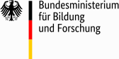
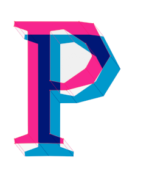

# Über das Projekt

Das Projekt wurde umgesetzt von [Ralf Zimmermann](https://github.com/waldhacker1),  
ermöglicht durch die [waldhacker UG (haftungsbeschränkt)](https://www.waldhacker.dev/)  
und gefördert durch das [Bundesministerium für Bildung und Forschung](https://www.bmbf.de).

[{: style="height:150px;width:150px"}](https://www.bmbf.de)

Vielen Dank auch an den [Prototype Fund](https://prototypefund.de/) und die [Open Knowledge Foundation Deutschland e.V.](https://okfn.de/) für die Unterstützung!

[{: style="height:150px;width:150px"}](https://prototypefund.de/) [{: style="height:150px;width:150px"}](https://okfn.de/)
