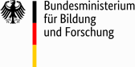
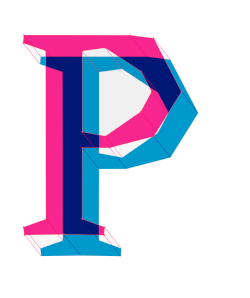
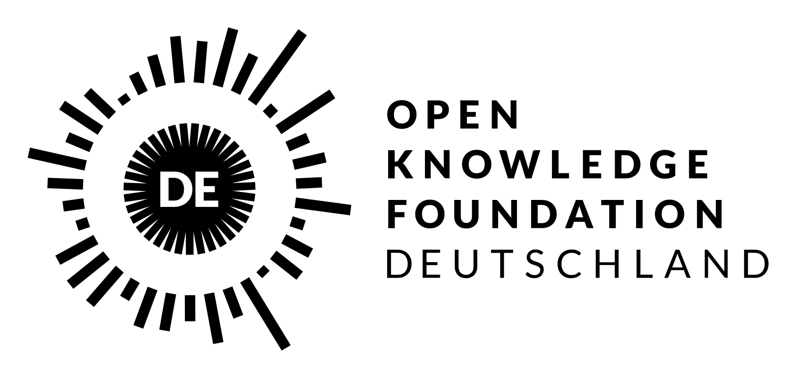

# About the project

The project was realized by Ralf Zimmermann,  
made possible by [waldhacker UG (haftungsbeschränkt)](https://www.waldhacker.dev/)  
and sponsored by the [Bundesministerium für Bildung und Forschung](https://www.bmbf.de).

[{: style="height:150px;width:150px"}](https://www.bmbf.de/bmbf/en/)

Many thanks also to the [Prototype Fund](https://prototypefund.de/en/) and the [Open Knowledge Foundation Deutschland e.V.](https://okfn.de/en/) for their support!

[{: style="height:150px;width:150px"}](https://prototypefund.de/en/) [{: style="height:150px;width:150px"}](https://okfn.de/en/)
