# Analyse and pseudonymize the database

## System overview

The menu item 'Information' provides an overview of the system configuration.

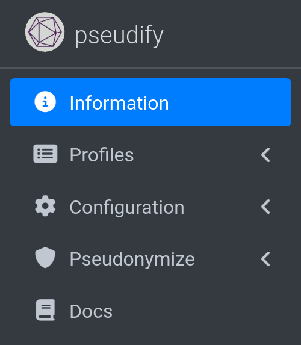{: style="height: 150px; margin-bottom: 1em;" }

The provided information is equivalent to that obtained with the command line command [`pseudify pseudify:information`](setup/configuration.md/#pseudifyinformation).

### Available profiles to analyze and pseudonymize the database

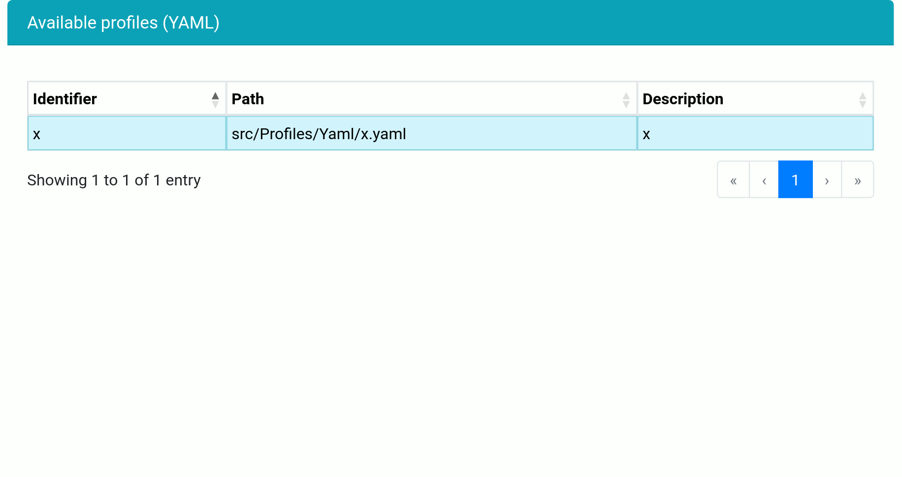{: style="height: 150px; margin-bottom: 1em;" }

### The values from the .env file.

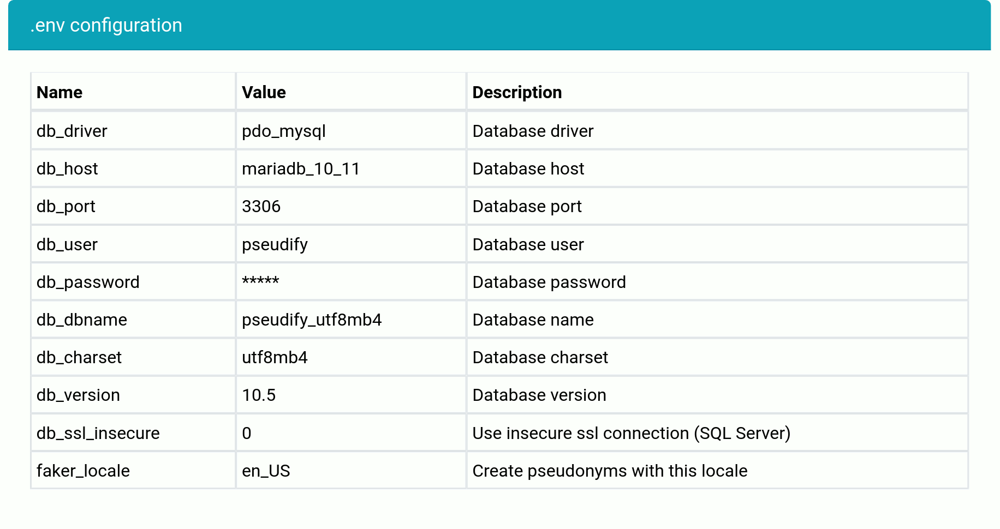{: style="height: 150px; margin-bottom: 1em;" }

### Registered condition expression functions

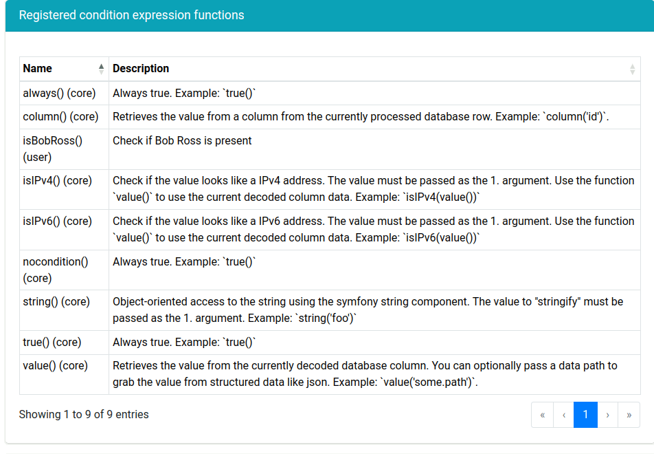{: style="height: 150px; margin-bottom: 1em;" }

### Registered data encoders / deoders

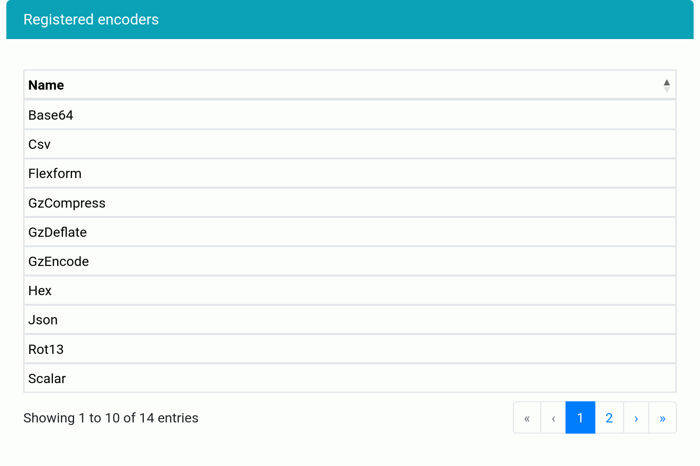{: style="height: 150px; margin-bottom: 1em;" }

### Registered doctrine type implementations

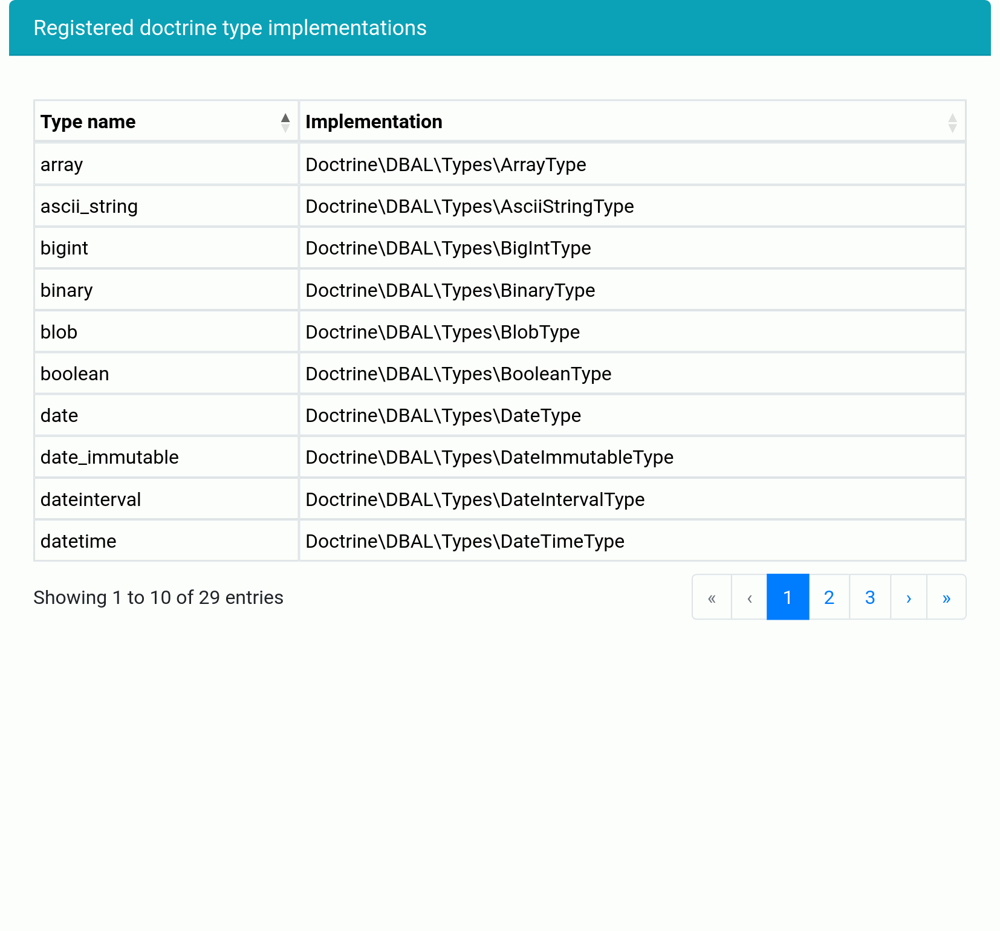{: style="height: 150px; margin-bottom: 1em;" }

### Connection details per connection

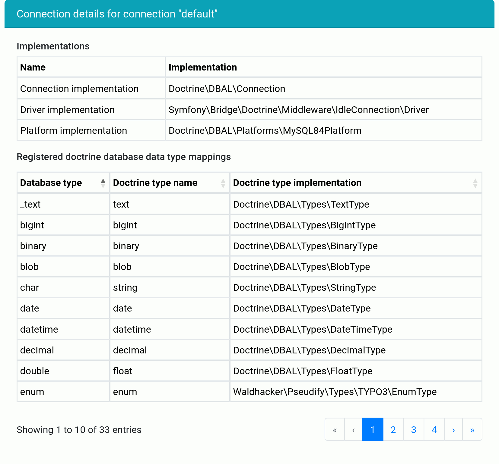{: style="height: 150px; margin-bottom: 1em;" }

### Available database drivers

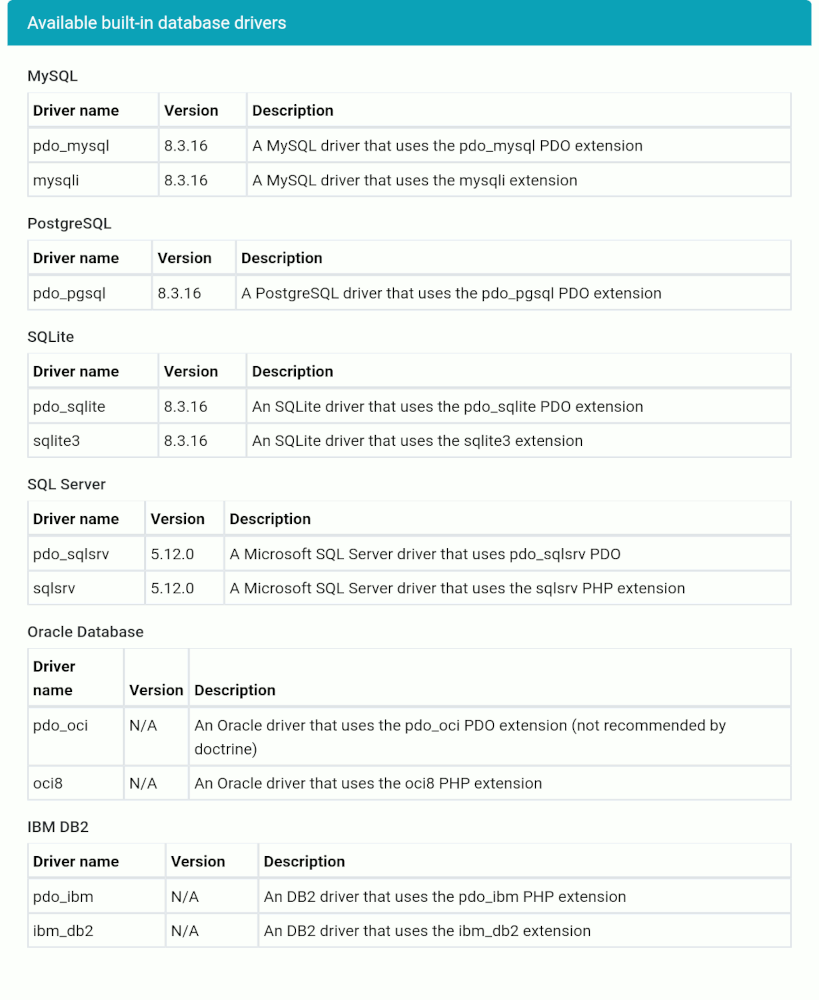{: style="height: 150px; margin-bottom: 1em;" }

## Create and edit profiles

The menu item 'Profiles > Load / Create' let you create profiles or load existing ones.

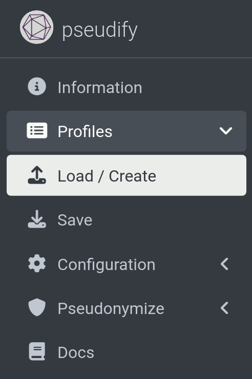{: style="height: 150px; margin-bottom: 1em;" }

No profile exists at the beginning, so one must be created.

{: style="height: 150px; margin-bottom: 1em;" }

### Identifier

A unique name that identifies the profile.

### Description

A short description for the profile.

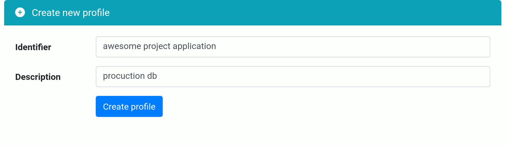{: style="height: 150px; margin-bottom: 1em;" }

Existing profiles can be selected from a list so that they can then be used.  
If [multiple connections are configured](setup/configuration.md#multiple-connection-configurations), the connections can also be selected.

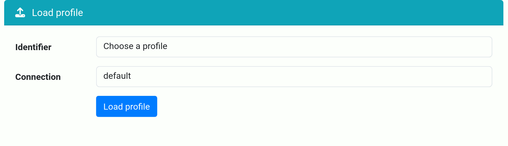{: style="height: 150px; margin-bottom: 1em;" }

If you want to unload the profile then click the button `Unload profile`.

{: style="height: 150px; margin-bottom: 1em;" }

### About `low-level profiles (PHP)`

Previous versions of pseudify were only able to work with PHP based profiles.  
While it is not possible to edit such profiles using the GUI, it is still possible to use these profiles with the command line commands [`pseudify:analyze`](#using-the-commandline_1) and [`pseudify:pseudonymize`](#using-the-commandline-recommended-for-cicd-usage).  
This profiles should be placed within the install package directory [`userdata/src/Profiles/`](https://github.com/waldhacker/pseudify-ai/blob/2.0.0/userdata/src/Profiles/).  
The creation of such profiles can be found in the documentation of older pseudify versions:  

* [Model an "Analyze Profile"](/docs/0.1/usage/analyze/#model-an-analyze-profile)
* [Model the pseudonymisation](/docs/0.1/usage/pseudonymize/#model-the-pseudonymisation)

##  Save profile

The menu item 'Profiles > Save' let you save profile changes.

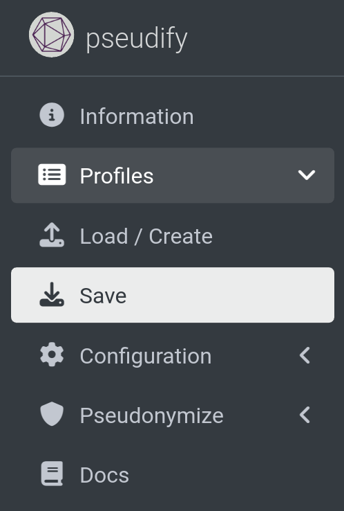{: style="height: 150px; margin-bottom: 1em;" }

Klick the Button `Save profile` to persist unsaved changes to the YAML file.

{: style="height: 150px; margin-bottom: 1em;" }

If there are unsaved profile changes, the GUI shows you this with an icon on each page. It can be seen at the top right.

{: style="height: 50px; margin-bottom: 1em;" }

## Modelling the pseudonymization

### Basic profile configuration

The menu item 'Configuration > Basic configuration' let you configure basic analyze and pseudonymization settings.

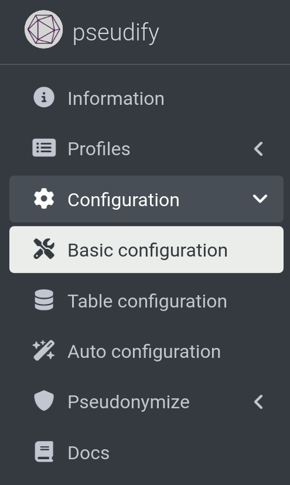{: style="height: 150px; margin-bottom: 1em;" }

#### Identifier

A unique name that identifies the profile.

#### Profile description

A short description for the profile.

#### Application name

The name of the application to which the database belongs. For example 'TYPO3' or 'Shopware'.  
The application name is important if the [AI feature](setup/installation.md#start-pseudify-with-ai-support) is used. It helps the AI to better understand the meaning of database data.  
If you don't use the AI feature, you don't need to fill this property.  

#### Application description

The description of the application to which the database belongs.  
The application description is important if the [AI feature](setup/installation.md#start-pseudify-with-ai-support) is used. It helps the AI to better understand the meaning of database data.  
The more detailed the description, the better the AI can analyze database data.  
If you don't use the AI feature, you don't need to fill this property.  

#### Data frame cutting length

Read [`Output extended information`](#output-extended-information) for details.

#### Search strings

Pseudify uses database data as a search source to find them in other hidden places in the database.  
However, it is also possible to use user-defined source data.  
As an alternative to static values, it is possible to use regular expressions for the search.  
A regular expression must be identified by the prefix `regex:` and follow the [PCRE regex syntax](https://www.php.net/manual/en/pcre.pattern.php).  
For example, `regex:(?:[0-9]{1,3}\.){3}[0-9]{1,3}` can be used to search for IPv4 addresses.  

#### Global excluded column types

You can exclude columns with certain data types from the analysis to shorten the search time.  
For example, in most cases it does not make sense to search database columns of the type `integer'.  
Data types can be excluded for certain tables or for all tables.
As soon as data types are excluded at the table level, the globally excluded data types are not additionally excluded for this table.  
Excluded column types are also ignored during pseudonymization.  

#### Exclude tables

You can exclude entire tables from the analysis to shorten the search time.  
Excluded tables are also ignored during pseudonymization.  

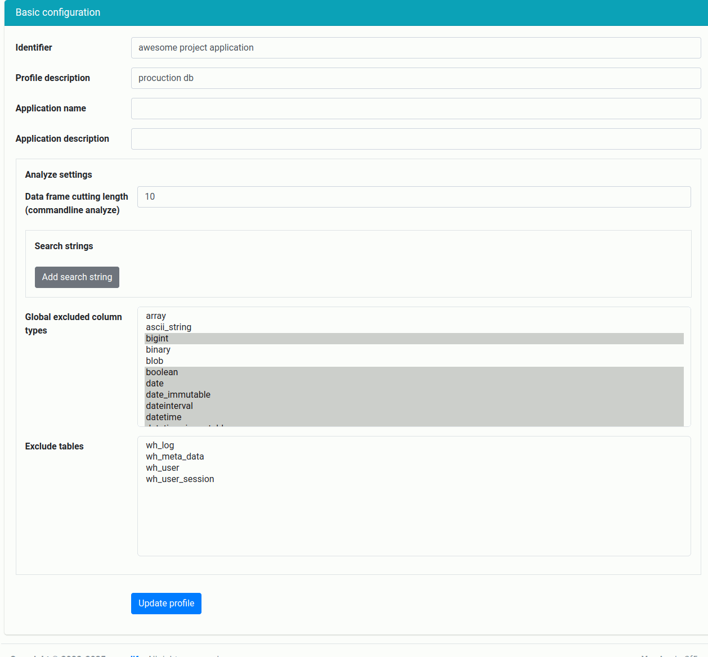{: style="height: 150px; margin-bottom: 1em;" }

### Table configuration

Under the menu item 'Configuration > Table configuration', you can configure the analysis and  settings on a table basis.

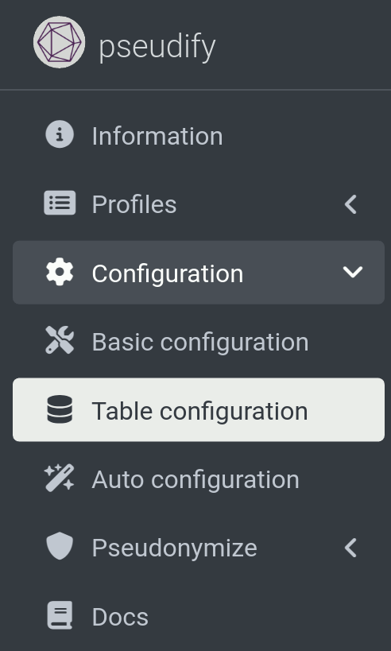{: style="height: 150px; margin-bottom: 1em;" }

All tables are listed.  
If you click on the table entry, the associated columns are listed.  
A table can be excluded from analysis and pseudonymization using the eye icon and configured using the gear icon.  
A column can be excluded from analysis and pseudonymization using the eye icon and configured using the gear icon.  

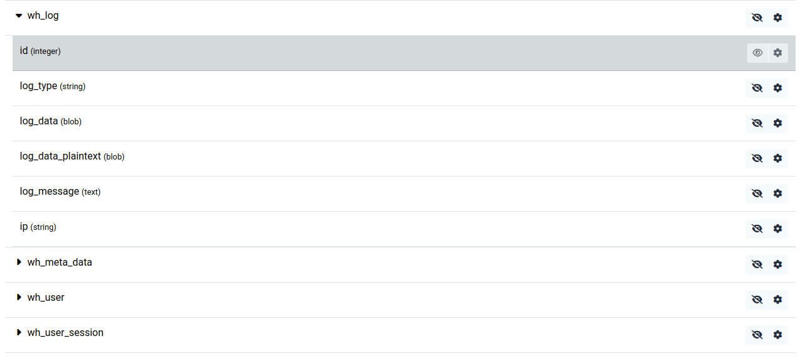{: style="height: 150px; margin-bottom: 1em;" }

#### Table description

The description of the table.  
The description is important if the [AI feature](setup/installation.md#start-pseudify-with-ai-support) is used. It helps the AI to better understand the meaning of database data.  
The more detailed the description, the better the AI can analyze database data.  
If you don't use the AI feature, you don't need to fill this property.  

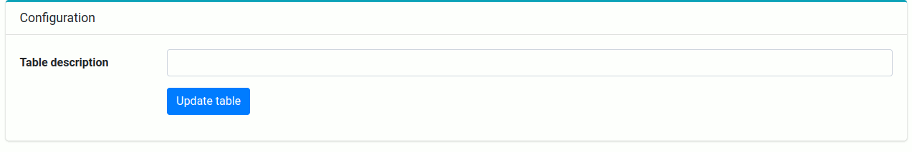{: style="height: 150px; margin-bottom: 1em;" }

### Column configuration

The column configuration is the central component for analysis and pseudonymization.  
The following is defined here:  

1. how must the data in the column be decoded so that personally identifiable information (`meanings`) can be found in them?
2. what kind of personally identifiable information (`meaning`) are contained in the decoded columns and how can they be pseudonymized?

In the case of scalar, i.e. non-encoded data, this is relatively easy to determine.  
However, there are also cases in which the data must first be decoded.  
There are different variants:

1. all column data is encoded with the same method, e.g. all data is encoded with base64.  
2. the column data is encoded using different methods and the decision which method to use to decode the data depends on the data in other columns.
3. variant 1 and 2 with the difference that the data is encoded several times. e.g. the data must first be decoded using base64 and then decompressed using gzip.
4. variant 1, 2 and 3 with the difference that the columns contain structured data such as JSON, CSV or serialized PHP data after decoding. This data must be decoded in such a way that the contained data structure can be accessed in order to access the personally identifiable information it contains.
5. variant 1, 2, 3 and 4 with the difference that the decoded structured data in turn contains other structured data, e.g. CSV data is contained in a property of a JSON object.

All these variants can be handled with pseudify using the column configuration.  

We will now go through the variants in a short tutorial:

#### Define column data encodings

##### Scalar data

This is the simplest variant.  
As you can see, no decoding is necessary as the 'Decoded data' column contains scalar data.  
The 'Data paths' column does not contain any values, as the decoded data is not structured data.  
If you click on the magnifying glass icon in the `Meanings` column, pseudify will try to guess the meaning of the decoded data and make suggestions.  
If the [AI feature](setup/installation.md#start-pseudify-with-ai-support) is used, the guessing is done using AI.  
These suggestions can now be used to [define the meaning of the data](#define-column-data-meanings).  

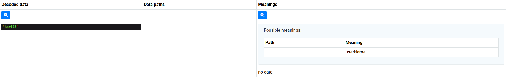{: style="height: 150px; margin-bottom: 1em;" }

##### Complex and conditional encodings

As you can see, the data appears to be encoded because it does not look like human-readable data.

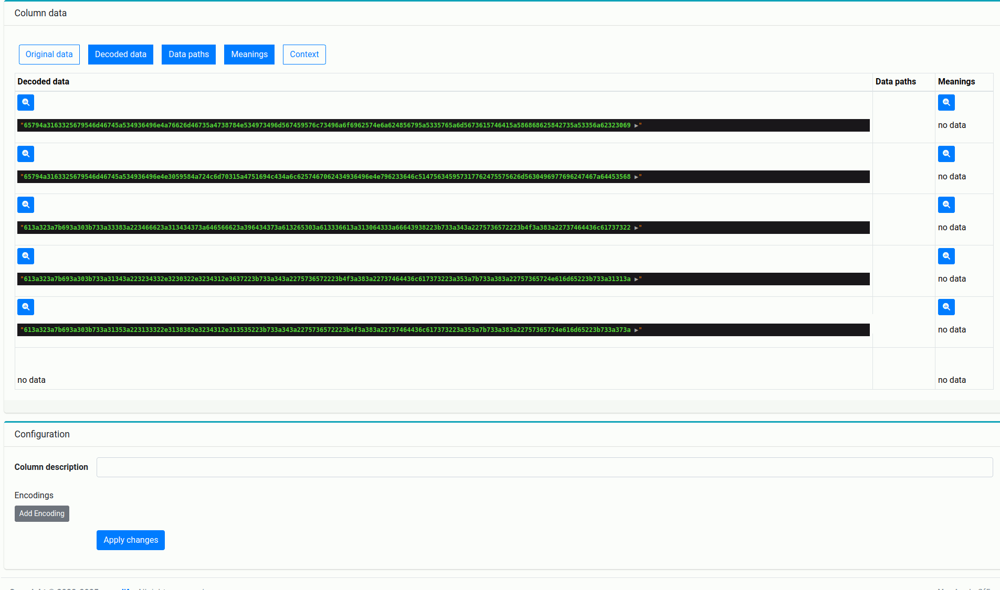{: style="height: 150px; margin-bottom: 1em;" }

If you click on the magnifying glass symbol in the `Decoded data` column, pseudify will try to guess the encoding of the data and make suggestions.  

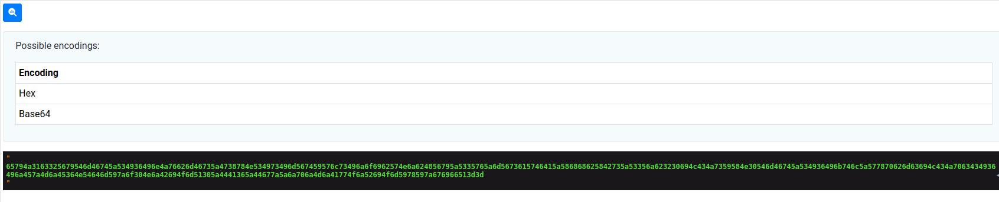{: style="height: 150px; margin-bottom: 1em;" }

In the column configuration, we now add a decoding by clicking the `Add encoding` button.  
Various properties can be defined here.  
For now, we only want to create a simple decoding and therefore click on the `Add encoder` button and select the suggested decoding using 'Hex'.  

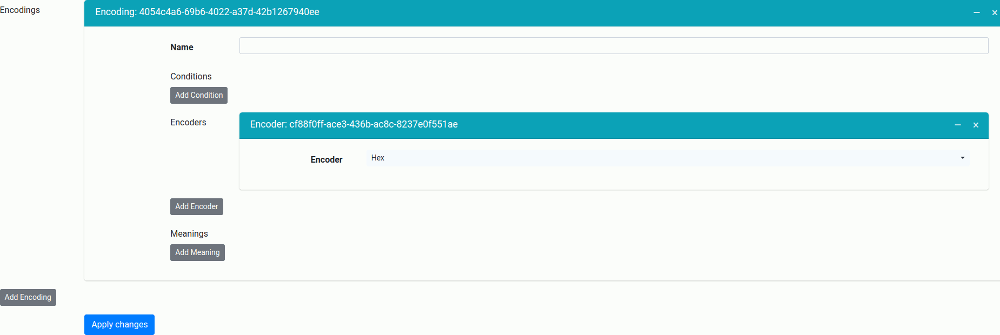{: style="height: 150px; margin-bottom: 1em;" }

The data appears to be decoded, but still not in a human-readable format. It seems that the data is still encoded.  
If you click on the magnifying glass icon in the `Decoded data` column, pseudify will try to guess the encoding of the data and make suggestions.  
It will guess that the data format looks like base64.

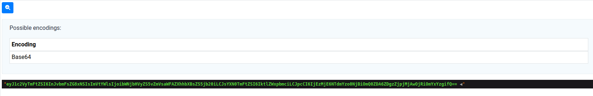{: style="height: 150px; margin-bottom: 1em;" }

We therefore create another decoding by clicking on the `Add encoder` button and select the suggested decoding using 'Base64'.  

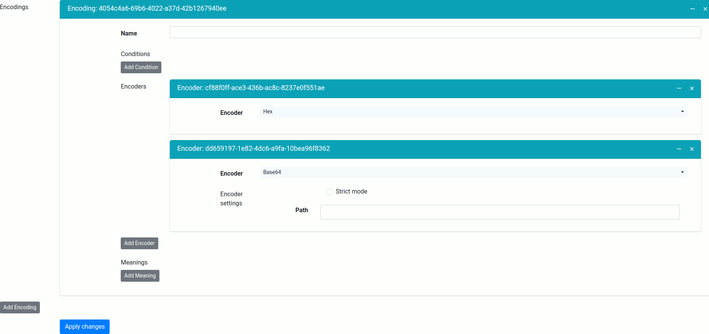{: style="height: 150px; margin-bottom: 1em;" }

In the first two columns we now see JSON data and in the other columns nothing meaningful seems to have been decoded.

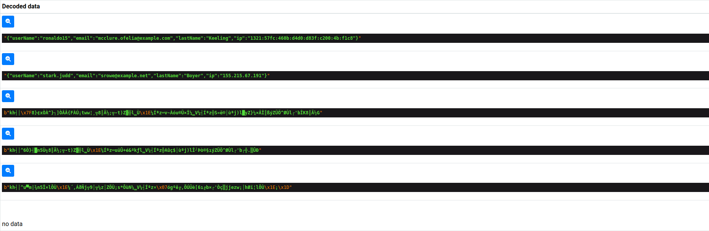{: style="height: 150px; margin-bottom: 1em;" }

Let's take a look at the surrounding data in the data set, the `Context`.  
To do this, we activate the `Context` column by clicking on `Context` at the top of the row of buttons.  
The data appears to be decoded correctly in the datasets for which the `log_type` column contains the value `foo`.  
The datasets in which the `log_type` column contains the value `bar` appear to be coded using other methods.  

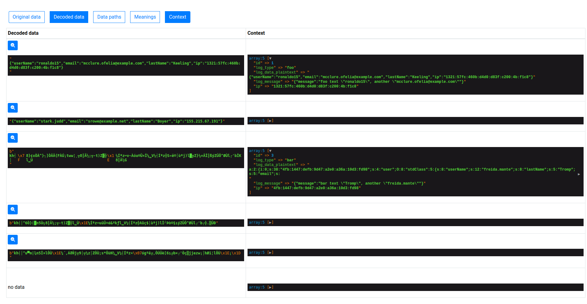{: style="height: 150px; margin-bottom: 1em;" }

We first restrict our encoding to all datasets for which the `log_type` column contains the value `foo`.  
To do this, we create a `condition` by clicking on the `Add condition` button.  
Here we write `column('log_type') == 'foo'` and save the configuration.  

!!! info
    All usable expression functions can be viewed in the configuration overview under [`Registered condition expression functions`](#registered-condition-expression-functions).  
    More information about the expression syntax can be found in the [symfony expression language documentation](https://symfony.com/doc/6.4/reference/formats/expression_language.html).

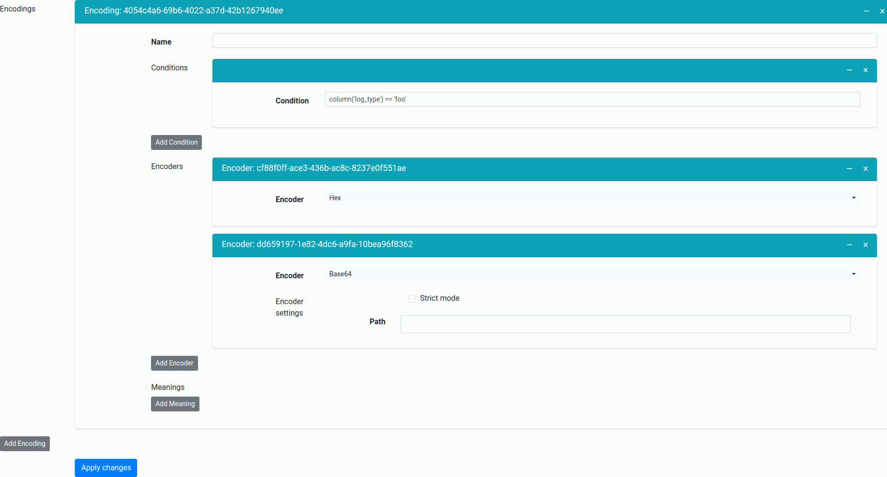{: style="height: 150px; margin-bottom: 1em;" }

We can see that our encoding now only decodes the datasets where the `log_type` column contains the value `foo`.  
The other datasets are not decoded.  
For these datasets, a further `Encoding` with the correspondingly modified condition `column('log_type') == 'bar'` can be generated.  
The `encoders` that decode these columns correctly can then be defined there.  

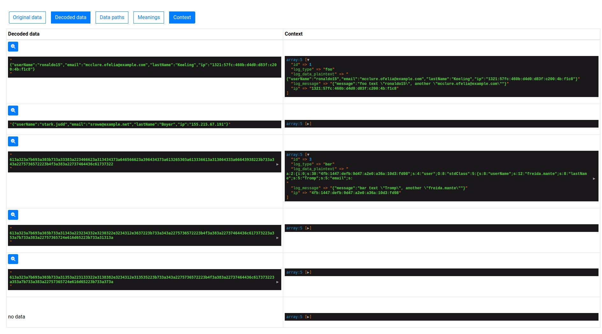{: style="height: 150px; margin-bottom: 1em;" }

We can see that our column contains structured data that needs to be decoded further.  
If you click on the magnifying glass icon in the `Decoded data` column, pseudify will try to guess the encoding of the data and make suggestions.  
It will guess that the data format looks like JSON.  

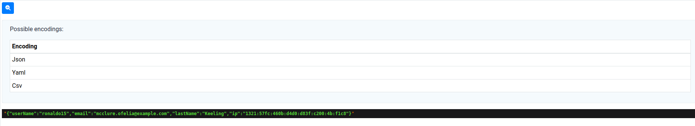{: style="height: 150px; margin-bottom: 1em;" }

We therefore create another decoding by clicking on the `Add encoder` button and select the suggested decoding using 'Json'.  

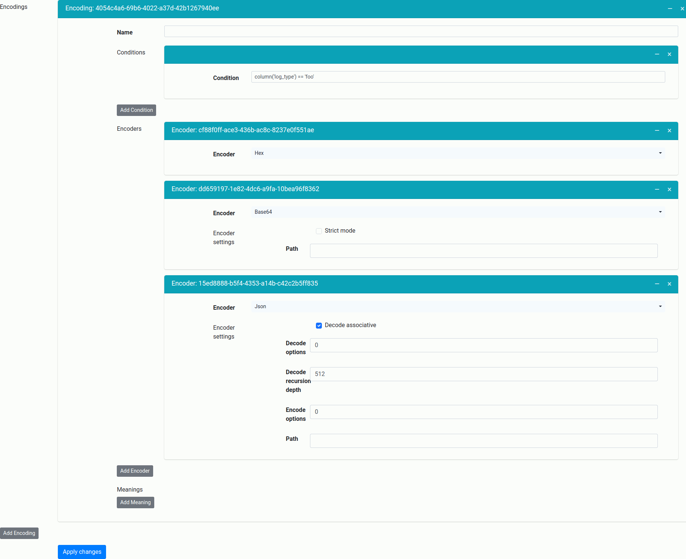{: style="height: 150px; margin-bottom: 1em;" }

We see that the column `Data paths` (column 2 in the screenshot) now shows us data. Using these paths, we can then [define the meanings of these data paths](#define-column-data-meanings).  

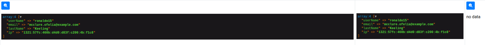{: style="height: 150px; margin-bottom: 1em;" }

##### Neasted encodings

It can happen that structured data such as JSON contains other structured data that contains personally identifiable information that we want to access.  
The example shows that the column was decoded several times in order to decode serialized PHP data at the end.

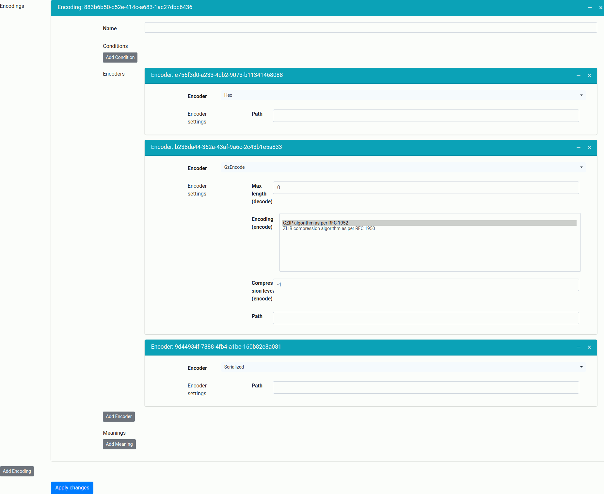{: style="height: 150px; margin-bottom: 1em;" }

You can see that the data path `key2.session_data` contains a character string, which in turn corresponds to serialized PHP data. We want to be able to access this in a structured way in order to be able to pseudonymize the IP address it contains.  

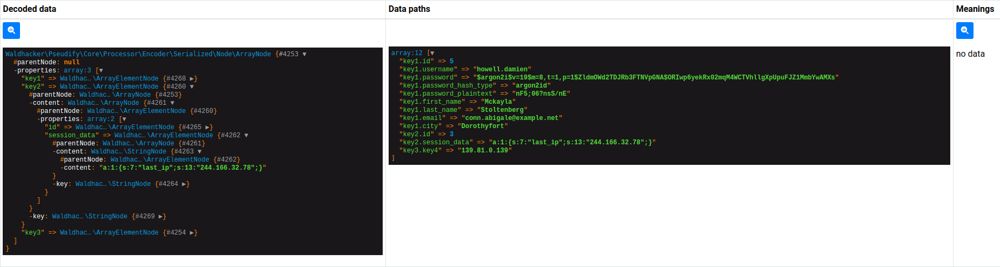{: style="height: 150px; margin-bottom: 1em;" }

We therefore add another decoder for serialized PHP data and write the data path `key2.session_data` in its `Path` option.  

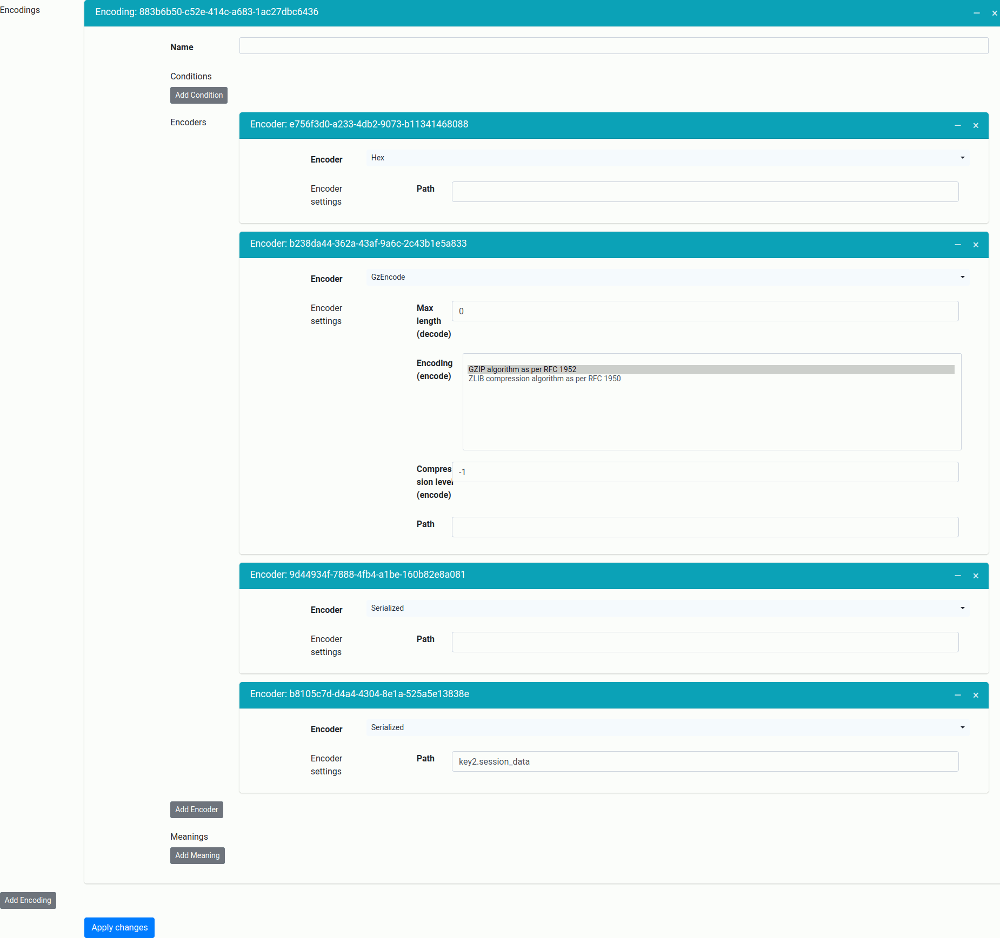{: style="height: 150px; margin-bottom: 1em;" }

Now the data path `key2.session_data` is interpreted as serialized PHP data. This data can now be accessed.

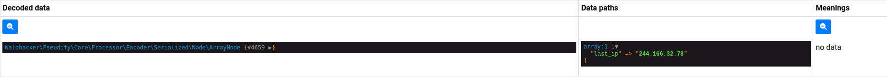{: style="height: 150px; margin-bottom: 1em;" }

!!! info
    The `Path` option in a decoder always refers to the decoded data generated by the **previously** added decoder.

!!! info
    It is currently not possible to decode multiple data paths in parallel. It is currently only possible to continue decoding one branch at a time in structured data.  
    If more complex decoding is required, the [`low-level profiles (PHP)`](#about-low-level-profiles-php) must be used.

#### Define column data meanings

Meanings are synonymous with personally identifiable information.  
A meaning has 2 functions:

1. All defined meanings are used in the analysis process to search for them in the rest of the database. In this way, unknown occurrences of this data can be identified and then also defined as a meaning.  
2. In the pseudonymization process, all defined meanings are exchanged for pseudonyms.  

In the example, we can see that the 'Data paths' column (column 2 in the screenshot) shows us data paths for the decoded data structure.  
We can now use these paths to define meanings.  
If the original data or the decoded data is scalar data, nothing will be visible in the 'Data paths' column, because in these cases pseudify can pseudonymize the decoded data directly.  

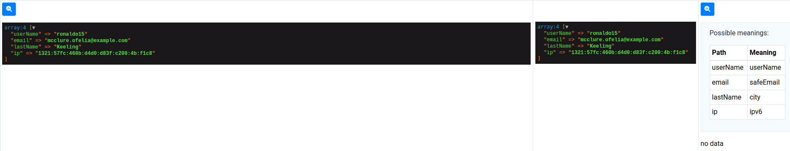{: style="height: 150px; margin-bottom: 1em;" }

A meaning can now be defined for each data path by clicking the `Add meaning` button.  

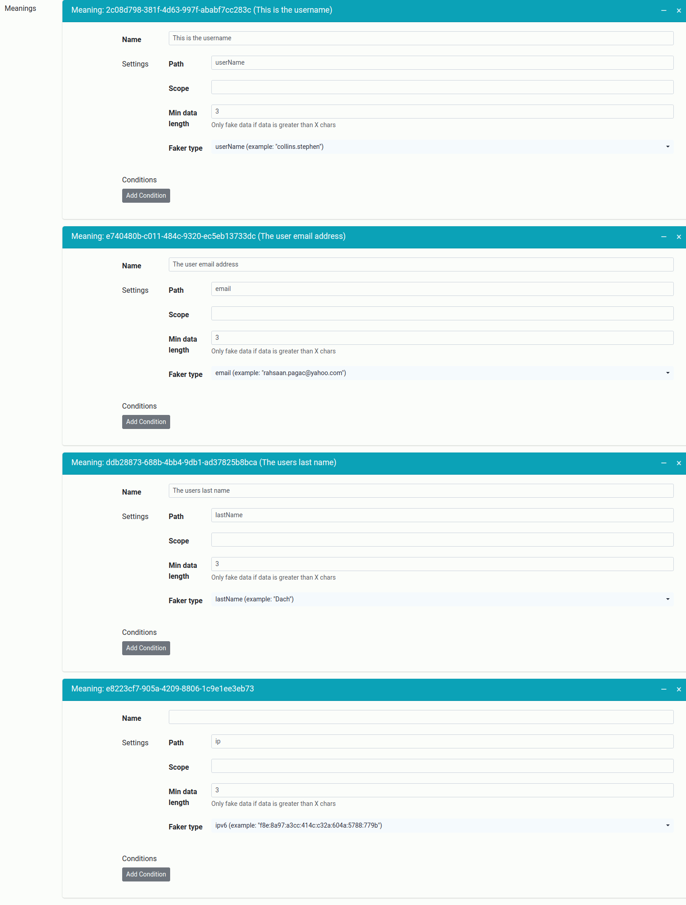{: style="height: 150px; margin-bottom: 1em;" }

##### Path

The data path for which the meaning is to apply must be entered here.  
In the case of scalar data, this option must remain empty.  

##### Faker type

Here you can select one of the available faker formats against which the decoded data is to be replaced during pseudonymization.  
Pseudify uses [the FakerPHP/Faker component](https://fakerphp.github.io/) to be able to fake various data formats.  
It is also possible to [define custom ones](setup/configuration.md#registering-custom-faker-formatters).  

---

After saving, the `Meanings` column shows which data would be replaced during pseudonymization (`originalValue`) and what a pseudonym would look like as an example (`fakedValue`).  

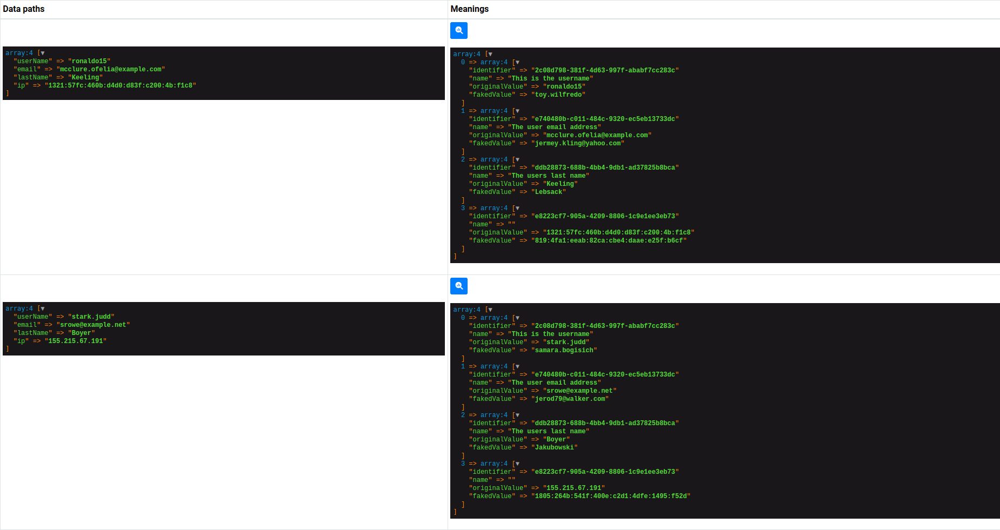{: style="height: 150px; margin-bottom: 1em;" }

##### Conditional meanings

As in the case of encodings, it may also be necessary to place conditions on meanings.  
The example shows that the `ip` data path can contain both ipv4 and ipv6 addresses.  
If it is important that these different address formats are retained during pseudonymization, then the meaning must be defined using conditions in such a way that one meaning fakes an ipv4 address
if the original data looks like an ipv4 address and the another meaning must do the same for ipv6 data formats.

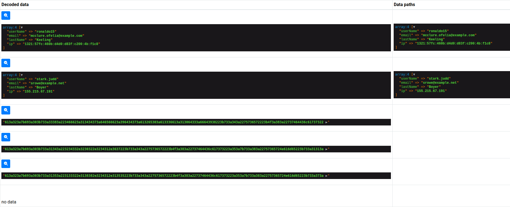{: style="height: 150px; margin-bottom: 1em;" }

To do this, 2 meanings are now defined for the same data path `ip` and placed under conditions.  
The first Meaning is given the condition `isIpV6(value('ip'))` and the second Meaning is given the condition `isIpV4(value('ip'))`.  

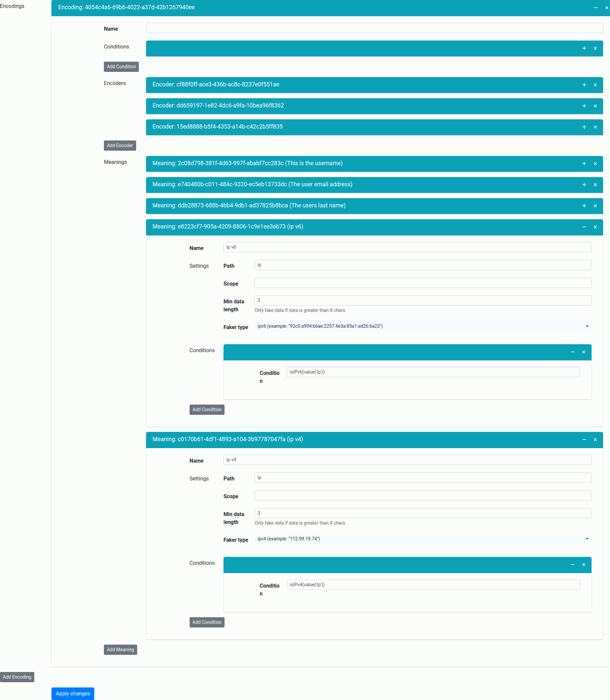{: style="height: 150px; margin-bottom: 1em;" }

After saving, you can see that the data is now faked in such a way that the original ipv4 and ipv6 data formats are retained.  

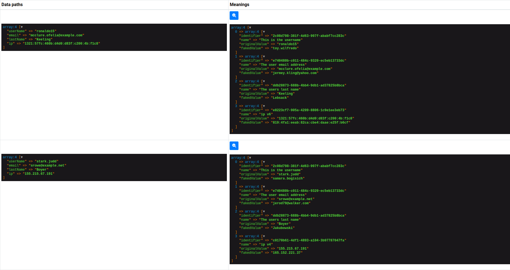{: style="height: 150px; margin-bottom: 1em;" }

##### The `scope` option

To preserve data integrity, pseudify is designed to always return the same pseudonym for the same input data during a pseudonymisation run.  
This means that during the execution of a pseudonymisation using `pseudify pseudify:pseudonymize test-profile`, all `userName` meanings will generate e.g. the pseudonym `Klaus` for the input data `Stan`.  
A new pseudonymisation of the original database using `pseudify pseudify:pseudonymize test-profile` will generate e.g. the pseudonym `Roger` for all `userName` meanings for the input data `Stan` and not `Klaus` as in the first pseudonymisation run.  

This ensures two things:

1. Within a pseudonymisation run, the same original data is always replaced with the same pseudonym.
   (The value "Stan" from Table 1 and Table 2 is replaced with "Klaus" in Table 1 and Table 2).
2. Between different pseudonymisation runs, the same original data generate different pseudonyms.
   (In the first pseudonymisation, the value "Stan" from Table 1 and Table 2 is replaced with "Klaus" in both tables,
   in the second pseudonymisation, the value "Stan" from Table 1 and Table 2 is replaced with the value "Roger" in both tables, and so on).

If for some reason you want to change this behaviour, you can define the option `scope`.  
With this option you can instruct pseudify to create different pseudonyms per `scope` for the same input data.  

#### Empty all column records

If this option is activated, all records in this column are set to the default value of the column during pseudonymization.  
In this case, all encodings and meanings have no function and are ignored.  

#### Column description

The description of the column.  
The description is important if the [AI feature](setup/installation.md#start-pseudify-with-ai-support) is used. It helps the AI to better understand the meaning of database data.  
The more detailed the description, the better the AI can analyze database data.  
If you don't use the AI feature, you don't need to fill this property.  

### Auto configuration

!!! note
    Save unsaved profile changes before running this action.  

The menu item 'Configuration > Autoconfiguration' attempts to guess the encodings and meanings for each database table and each database column.
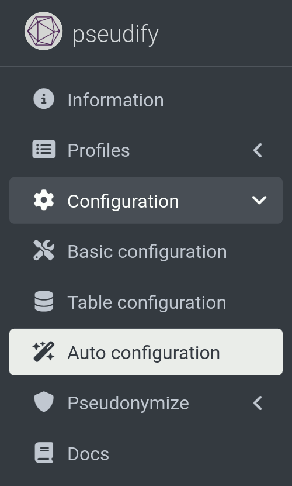{: style="height: 150px; margin-bottom: 1em;" }

The autoconfiguration goes through all tables and their columns and tries to decode the columns and then guess a meaning in them.  
However, it is currently only able to decode simple encodings. If a column is encoded several times with different encodings, the autoconfiguration will not deliver correct results.  
But expect wrong results in any case. The autoconfiguration is intended to provide a rough introduction to the configuration. You should check all table column configurations after an autoconfiguration.  
If you have [activated the AI feature](setup/installation.md#start-pseudify-with-ai-support), the autoconfiguration also attempts to recognize the application and the table and column descriptions for you.  

The autoconfiguration only guesses the encoding if no encodings have yet been defined for the column.  
The same rules for the meaning.  

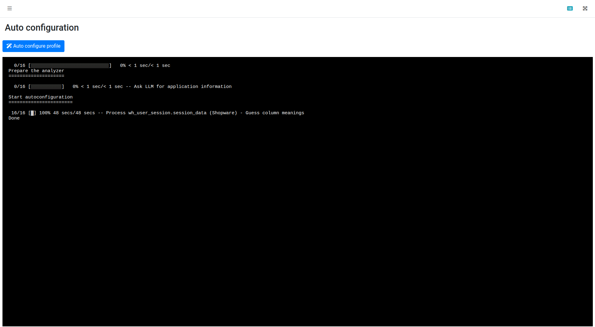{: style="height: 150px; margin-bottom: 1em;" }

#### Using the commandline

## Analyze database data

!!! note
    Save unsaved profile changes before running this action.  

The menu item 'Pseudonymize > Analyze' executes the command [`pseudify:analyze`](#using-the-commandline_1) and displays the result in the browser.

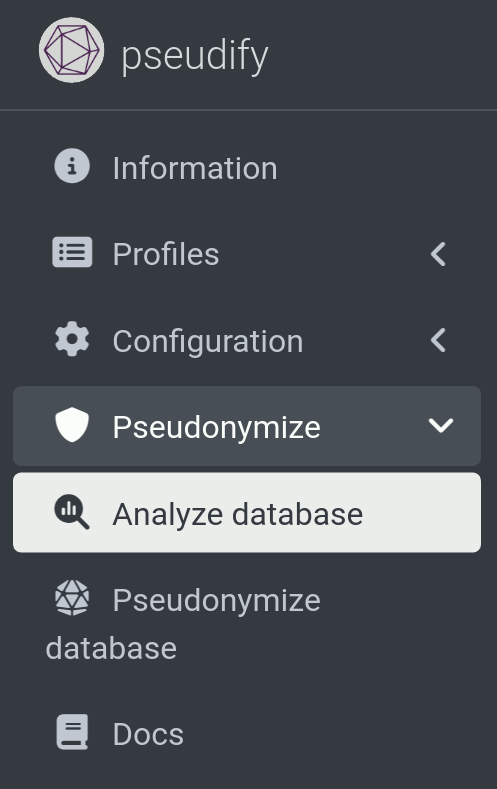{: style="height: 150px; margin-bottom: 1em;" }

The analysis process is used to determine in which “unlit corners” of the database personally identifiable information (PII) is hidden.
We therefore use the personally identifiable information already known to us, which we have defined as `meanings`, to find them in the rest of the database.

!!! warning
    In order to be able to display the command output, pseudify writes output to the file `userdata/var/log/analyze.log`.  
    This file may contain sensitive data.  
    Pseudify deletes this file after an analysis, but things can be wrong. You should ensure that there are no leftovers.  

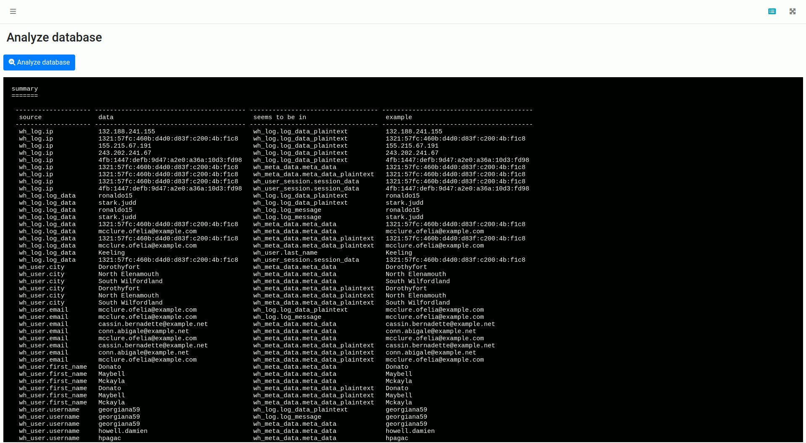{: style="height: 150px; margin-bottom: 1em;" }

### Using the commandline

An analyze can be executed with the command `pseudify:analyse <profile-name>`.

```shell
$ docker run --rm -it -v "$(pwd)/userdata/":/opt/pseudify/userdata/ \
    ghcr.io/waldhacker/pseudify-ai:2.0 pseudify:analyze test-profile
```

!!! warning
    In order to be able to analyze the database data fast, pseudify writes database content to the file system path `userdata/var/cache/pseudify/database/`.  
    This data contain sensitive data.  
    Pseudify deletes this data after an analysis, but things can be wrong. You should ensure that there are no leftovers in this file system path after an analysis.  

The summary of the analysis lists which source data (column `data`) from which source database column (column `source`) can be found in which database columns (column `seems to be in`).  
If there is a `__custom__.__custom__` in the `source` column, this means that the source data does not come from a database column, but was defined using [`search strings`](#search-strings).  
If you were not previously aware that certain source data can be found in a database column under `seems to be in`, then you can now take a closer look at these database columns and define the data as [`meanings`](#define-column-data-meanings).

#### Output extended information

For debugging or refining the analysis, it may be useful to see what data pseudify found in the database data.  
To do this, the command `pseudify:analyse` can be called with the parameter `--verbose`:

```shell
$ docker run --rm -it -v "$(pwd)/userdata/":/opt/pseudify/userdata/ \
    ghcr.io/waldhacker/pseudify-ai:2.0 pseudify:analyze <profil-name> --verbose
```

Now the source data is listed in the column `source` like `1321:57fc:460b:d4d0:d83f:c200:4b:f1c8`.  
The column `example` contains the finding like '...ip";s:37:"`1321:57fc:460b:d4d0:d83f:c200:4b:f1c8`";}";}s:4:...'.
The number of characters that are output before and after the finding can be defined with the [`Data frame cutting length`](#data-frame-cutting-length) option.  
By default, 10 characters are output before and after a finding.  
If the value is set to 0, nothing is cut off before and after the finding and the complete column content is output.  

#### Advanced options

* `--connection <connection-name>`: Read [Multiple connection configurations](setup/configuration.md#multiple-connection-configurations)

## Pseudonymize database data

!!! note
    Save unsaved profile changes before running this action.  

The menu item 'Pseudonymize > Pseudonymize' executes the command [`pseudify:pseudonymize`](#using-the-commandline-recommended-for-cicd-usage) and displays the result in the browser.

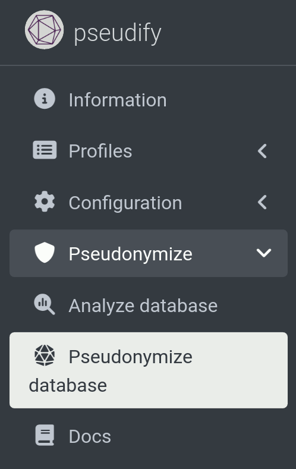{: style="height: 150px; margin-bottom: 1em;" }

!!! warning
    In order to be able to display the command output, pseudify writes output to the file `userdata/var/log/pseudonymize.log`.  
    This file may contain sensitive data.  
    Pseudify deletes this file after an pseudonymization, but things can be wrong. You should ensure that there are no leftovers.  

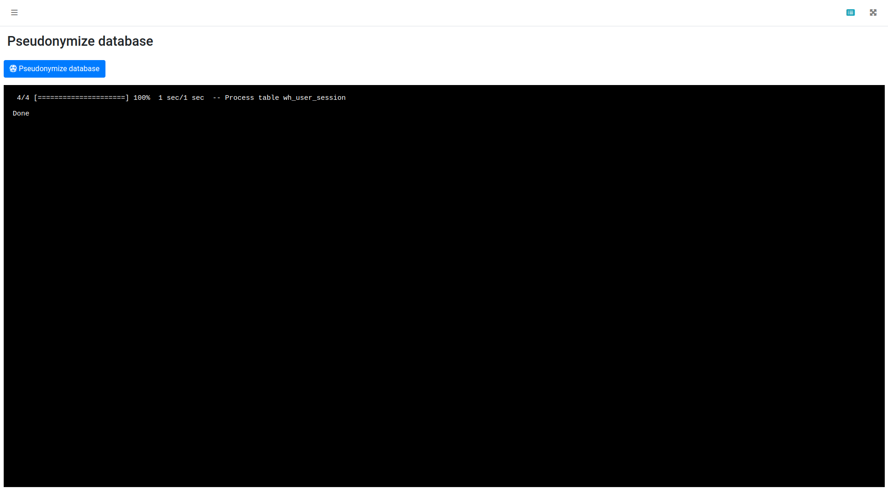{: style="height: 150px; margin-bottom: 1em;" }

### Using the commandline (recommended for CI/CD usage)

A pseudonymization can be executed with the command `pseudify:pseudonymize <profile-name>`.  
After the pseudonymization, the word `done` is displayed.  
That's it.

```shell
$ docker run --rm -it -v "$(pwd)/userdata/":/opt/pseudify/userdata/ \
    ghcr.io/waldhacker/pseudify-ai:2.0 pseudify:pseudonymize test-profile
```

#### Dry run

You can test your pseudonymization without overwriting the data in the database. With the parameter `--dry-run` all SQL statements are logged to the file `userdata/var/log/pseudify_dry_run.log` that pseudify would execute.  

!!! note
    The original data and the pseudonymized data are not logged one-to-one.  
    Valid SQL would be `UPDATE wh_user SET username = 'tavares.satterfield' WHERE username = 'karl13'`.  
    However, `--dry-run` additionally lists the name of the [internally used placeholder](https://www.doctrine-project.org/projects/doctrine-dbal/en/3.9/reference/query-builder.html#binding-parameters-to-placeholders) (e.g. `:dcValue1:`, `:dcValue2:` ...) before the data, which can simplify debugging.  

#### Advanced options

* `--connection <connection-name>`: Read [Multiple connection configurations](setup/configuration.md#multiple-connection-configurations)

##### Parallel execution

If your database is very large, you can speed up the pseudonymization process by performing it in parallel with the option `--parallel`.

```shell
$ docker run --rm -it -v "$(pwd)/userdata/":/opt/pseudify/userdata/ \
    ghcr.io/waldhacker/pseudify-ai:2.0 pseudify:pseudonymize test-profile --parallel
```

It is not possible to say in general whether serial or parallel processing is faster. You have to try it out.
Parallel processing can be configured with 2 parameters:

* `--concurrency <number>`: How many parallel processes. Default: 10
* `--items-per-process <number>`: How many rows to processes each parallel execution. Default: 5000

```shell
$ docker run --rm -it -v "$(pwd)/userdata/":/opt/pseudify/userdata/ \
    ghcr.io/waldhacker/pseudify-ai:2.0 pseudify:pseudonymize test-profile --parallel --concurrency 10 --items-per-process  5000
```
