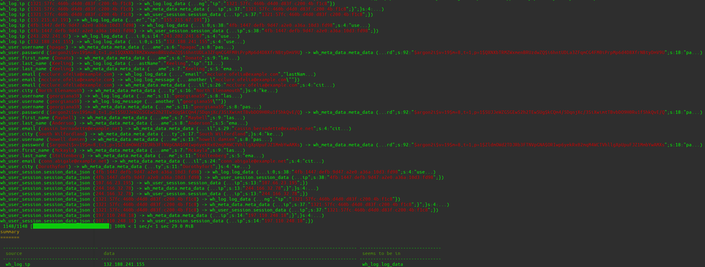

# Analysieren

## Die Analyse modellieren

!!! info
    Alle in diesem Tutorial beschriebenen Modellierungen kannst du dir mit Kommentaren [im
    Testordner der Profile Templates (TestAnalyzeProfile.php)](https://github.com/waldhacker/pseudify-profile-templates/blob/0.0.1/src/Profiles/Tests/TestAnalyzeProfile.php) anschauen.

### Einen Überblick verschaffen

Um einen Überblick über die Daten in der Datenbank zu bekommen, kann das Kommando `pseudify:debug:table_schema` verwendet werden.  
Du kannst aber natürlich auch jedes andere Tool deiner Wahl dazu verwenden.  

```shell
$ pseudify pseudify:debug:table_schema

wh_log
------

 -------------------- --------- --------------------------------------------------------------------------------------------------------- 
  column               type      data example                                                                                             
 -------------------- --------- --------------------------------------------------------------------------------------------------------- 
  id                   integer   6                                                                                                        
  log_type             string    foo                                                                                                      
  log_data             blob      613a323a7b693a303b733a33383a223466623a313434373a646566623a396434373a613265303a613336613a313064333a66...  
  log_message          text      {"message":"foo text \"ronaldo15\", another \"mcclure.ofelia@example.com\""}                             
  ip                   string    4fb:1447:defb:9d47:a2e0:a36a:10d3:fd98                                                                   
 -------------------- --------- --------------------------------------------------------------------------------------------------------- 

wh_meta_data
------------

 --------------------- --------- --------------------------------------------------------------------------------------------------------- 
  column                type      data example                                                                                             
 --------------------- --------- --------------------------------------------------------------------------------------------------------- 
  id                    integer   5                                                                                                        
  meta_data             blob      1f8b08000000000000036592dd6ea33010855f65657159116ca0818922f52fca6ea5d52a4bab46bd89066c821b302c769246...  
 --------------------- --------- --------------------------------------------------------------------------------------------------------- 

wh_user
-------

 -------------------- --------- ---------------------------------------------------------------------------------------------- 
  column               type      data example                                                                                  
 -------------------- --------- ---------------------------------------------------------------------------------------------- 
  id                   integer   5                                                                                             
  username             string    howell.damien                                                                                 
  password             string    $argon2i$v=19$m=8,t=1,p=1$ZldmOWd2TDJRb3FTNVpGNA$ORIwp6yekRx02mqM4WCTVhllgXpUpuFJZ1MmbYwAMXs  
  first_name           string    Mckayla                                                                                       
  last_name            string    Stoltenberg                                                                                   
  email                string    cassin.bernadette@example.net                                                                 
  city                 string    South Wilfordland                                                                             
 -------------------- --------- ---------------------------------------------------------------------------------------------- 

wh_user_session
---------------

 ------------------- --------- -------------------------------------------------------------------- 
  column              type      data example                                                        
 ------------------- --------- -------------------------------------------------------------------- 
  id                  integer   5                                                                   
  session_data        blob      a:1:{s:7:"last_ip";s:38:"4fb:1447:defb:9d47:a2e0:a36a:10d3:fd98";}  
  session_data_json   text      {"data":{"last_ip":"4fb:1447:defb:9d47:a2e0:a36a:10d3:fd98"}}
 ------------------- --------- --------------------------------------------------------------------
```

Das Kommando gibt nacheinander alle Tabellen der Datenbank aus und listet deren Spalten auf.  
In der Spalte `column` befindet sich der Name der Datenbankspalte.  
In der Spalte `type` steht der [menschenlesbarer Name des Datentyps](https://github.com/doctrine/dbal/blob/3.5.x/src/Types/Types.php#L13-L41) der Datenbankspalte.  
In der Spalte `data example` befindet sich der jeweils längste Datensatz, welcher in der Datenbank in dieser Datenbankspalte gefunden werden kann. Nach 100 Zeichen werden die Daten abgeschnitten.  

Suche nach personenbezogenen Daten, welche du pseudonymisieren möchtest.  
Suche nach Namen, Benutzernamen, Passwörtern, Adressen, E-Mail-Adressen, IP-Adressen, Telefonnummern, ID-Nummern wie Versicherungsnummern, Profildaten wie Größe oder Gewicht usw.  

!!! info
    Falls du Anregungen brauchst, dann lies das Kapitel ["Was sollte pseudonymisiert werden?"](../whatToPseudonymize.md)

Notiere dir am besten die Spalten mit direkt sichtbaren personenbezogenen Daten, also die Spalten welche Daten im Klartext enthalten und nicht solche mit komplexeren Datenstrukturen wie JSON (z.B. die Spalte `wh_log.log_message`) oder solche in denen die Daten in enkodierter Form vorliegen (z.B. die Spalte `wh_log.log_data`).  
Im Beispiel wären die bevorzugten Spalten:

* `wh_log.ip`
* `wh_user.username`
* `wh_user.password`
* `wh_user.first_name`
* `wh_user.last_name`
* `wh_user.email`
* `wh_user.city`

### Ein "Analyze Profile" modellieren

#### Ein "Profile" anlegen

Lege im Ordner [src/Profiles](https://github.com/waldhacker/pseudify-profile-templates/tree/0.0.1/src/Profiles) eine PHP Datei mit einem beliebigen Namen an.  
Im Beispiel wird die Datei `TestAnalyzeProfile.php` genannt.  
Die Datei bekommt folgenden Inhalt:

```php
<?php

namespace Waldhacker\Pseudify\Profiles;

use Waldhacker\Pseudify\Core\Profile\Analyze\ProfileInterface;
use Waldhacker\Pseudify\Core\Profile\Model\Analyze\TableDefinition;

class TestAnalyzeProfile implements ProfileInterface
{
    public function getIdentifier(): string
    {
        return 'test-profile';
    }

    public function getTableDefinition(): TableDefinition
    {
        $tableDefinition = new TableDefinition(identifier: $this->getIdentifier());

        return $tableDefinition;
    }
}
```

Die Methode `getIdentifier()` muss eine eindeutige Bezeichnung deines Profils wiedergeben und sollte nur aus Buchstaben, Zahlen oder den Zeichen `-` und `_` bestehen und darf keine Leerzeichen enthalten.  

Nach der Erzeugung des Profils muss der Cache geleert werden. 

```shell
$ pseudify cache:clear
```

Der Befehl `pseudify pseudify:debug:analyze test-profile` gibt dir nun bereits Informationen über dein Profil aus.

```shell
$ pseudify pseudify:debug:analyze test-profile

Analyzer profile "test-profile"
===============================

Basis configuration
-------------------

 ----------------------------------------------- ------- 
  Key                                             Value  
 ----------------------------------------------- ------- 
  Shown characters before and after the finding   10     
 ----------------------------------------------- ------- 

Collect search data from this tables
------------------------------------

 ------- -------- --------------- ----------------- 
  Table   column   data decoders   data collectors  
 ------- -------- --------------- ----------------- 

Search data in this tables
--------------------------

 ----------------- -------------------------- --------------- ----------------------- 
  Table             column                     data decoders   special data decoders  
 ----------------- -------------------------- --------------- ----------------------- 
  wh_log            id (integer)               Scalar          no further processing  
  wh_log            log_type (string)          Scalar          no further processing  
  wh_log            log_data (blob)            Scalar          no further processing  
  wh_log            log_message (text)         Scalar          no further processing  
  wh_log            ip (string)                Scalar          no further processing  
  wh_meta_data      id (integer)               Scalar          no further processing  
  wh_meta_data      meta_data (blob)           Scalar          no further processing  
  wh_user           id (integer)               Scalar          no further processing  
  wh_user           username (string)          Scalar          no further processing  
  wh_user           password (string)          Scalar          no further processing  
  wh_user           first_name (string)        Scalar          no further processing  
  wh_user           last_name (string)         Scalar          no further processing  
  wh_user           email (string)             Scalar          no further processing  
  wh_user           city (string)              Scalar          no further processing  
  wh_user_session   id (integer)               Scalar          no further processing  
  wh_user_session   session_data (blob)        Scalar          no further processing  
  wh_user_session   session_data_json (text)   Scalar          no further processing  
 ----------------- -------------------------- --------------- ----------------------- 
```

#### Quelldaten definieren

!!! info
    Mit dem "Analyze Profile" wird ermittelt, in welchen "unbeleuchteten Ecken" der Datenbank sich noch weitere personenbezogene Daten verstecken.  
    Wir verwenden darum die uns bereits bekannten personenbezogene Daten, welche wir im ersten Schritt identifiziert haben, um sie in der restlichen Datenbank aufzuspüren.  

Wir haben personenbezogene Daten in folgenden Spalten identifiziert:

* `wh_log.ip`
* `wh_user.username`
* `wh_user.password`
* `wh_user.first_name`
* `wh_user.last_name`
* `wh_user.email`
* `wh_user.city`

Du musst pseudify nun mitteilen, dass du die Daten in diesen Spalten als Quelldaten verwenden möchtest.  
Dazu erweiterst du die Methode `getTableDefinition()` im Profil.

```php
    public function getTableDefinition(): TableDefinition
    {
        $tableDefinition = new TableDefinition(identifier: $this->getIdentifier());

        $tableDefinition
            ->addSourceTable(table: 'wh_log', columns: [
                'ip',
            ])
            ->addSourceTable(table: 'wh_user', columns: [
                'username',
                'password',
                'first_name',
                'last_name',
                'email',
                'city',
            ])
        ;

        return $tableDefinition;
    }
``` 

Mit der Methode [`addSourceTable()`](https://github.com/waldhacker/pseudify-core/blob/0.0.1/src/src/Profile/Model/Analyze/TableDefinition.php#L103) sagst du pseudify, in welcher Datenbanktabelle und in welchen Datenbankspalten die Quelldaten gesammelt werden sollen.  
Pseudify wird dann automatisch in allen anderen Datenbankspalten der Datenbanktabellen nach Vorkommen der Quelldaten suchen und diese ausgeben.  
Zuvor standen in der Ausgabe des Kommandos `pseudify:debug:analyze test-profile` unter `Search data in this tables` alle Datenbanktabellen und alle Datenbankspalten.  
Nun werden dort nur noch die Datenbanktabellen und deren Datenbankspalten aufgelistet, welche nicht als Quelldaten mittels `addSourceTable()` definiert wurden.  

```shell
$ pseudify pseudify:debug:analyze test-profile

Analyzer profile "test-profile"
===============================

Basis configuration
-------------------

 ----------------------------------------------- ------- 
  Key                                             Value  
 ----------------------------------------------- ------- 
  Shown characters before and after the finding   10     
 ----------------------------------------------- ------- 

Collect search data from this tables
------------------------------------

 --------- --------------------- --------------- ----------------------- 
  Table     column                data decoders   data collectors        
 --------- --------------------- --------------- ----------------------- 
  wh_log    ip (string)           Scalar          default (scalar data)  
  wh_user   username (string)     Scalar          default (scalar data)  
  wh_user   password (string)     Scalar          default (scalar data)  
  wh_user   first_name (string)   Scalar          default (scalar data)  
  wh_user   last_name (string)    Scalar          default (scalar data)  
  wh_user   email (string)        Scalar          default (scalar data)  
  wh_user   city (string)         Scalar          default (scalar data)  
 --------- --------------------- --------------- ----------------------- 

Search data in this tables
--------------------------

 ----------------- -------------------------- --------------- ----------------------- 
  Table             column                     data decoders   special data decoders  
 ----------------- -------------------------- --------------- ----------------------- 
  wh_log            id (integer)               Scalar          no further processing  
  wh_log            log_type (string)          Scalar          no further processing  
  wh_log            log_data (blob)            Scalar          no further processing  
  wh_log            log_message (text)         Scalar          no further processing  
  wh_meta_data      id (integer)               Scalar          no further processing  
  wh_meta_data      meta_data (blob)           Scalar          no further processing  
  wh_user           id (integer)               Scalar          no further processing  
  wh_user_session   id (integer)               Scalar          no further processing  
  wh_user_session   session_data (blob)        Scalar          no further processing  
  wh_user_session   session_data_json (text)   Scalar          no further processing  
 ----------------- -------------------------- --------------- -----------------------
```

##### Enkodierte Daten als Quelldaten

Es kommt vor, dass Daten in Datenbankspalten in enkodierter Form vorliegen.  
Das bedeutet, der kodierte Klartext muss während der Analyse dekodiert werden, um ihn als Quelldaten verwenden zu können.  
Ähnlich wie unter ["Enkodierte Daten durchsuchen"](#enkodierte-daten-durchsuchen) beschrieben, können auch die Datenbankspalten der Quelldaten dekodiert werden.  

Der Methode [`SourceColumn::create()`](https://github.com/waldhacker/pseudify-core/blob/0.0.1/src/src/Profile/Model/Analyze/SourceColumn.php#L108) kann mit dem Parameter `dataType` [ein Name eines Built-in Dekodierers](https://github.com/waldhacker/pseudify-core/blob/0.0.1/src/src/Profile/Model/Analyze/SourceColumn.php#L38-L50) mitgegeben werden.  

!!! note
    Wie unter ["Mehrfach enkodierte Daten durchsuchen"](#mehrfach-enkodierte-daten-durchsuchen) beschrieben kann auch hier der [`ChainedEncoder`](https://github.com/waldhacker/pseudify-core/blob/0.0.1/src/src/Processor/Encoder/ChainedEncoder.php) verwendet werden, um mehrfach enkodierte Daten zu dekodieren.  

```php
<?php

namespace Waldhacker\Pseudify\Profiles;

use Waldhacker\Pseudify\Core\Profile\Analyze\ProfileInterface;
use Waldhacker\Pseudify\Core\Profile\Model\Analyze\SourceColumn;
use Waldhacker\Pseudify\Core\Profile\Model\Analyze\TableDefinition;

class TestAnalyzeProfile implements ProfileInterface
{
    public function getIdentifier(): string
    {
        return 'test-profile';
    }

    public function getTableDefinition(): TableDefinition
    {
        $tableDefinition = new TableDefinition(identifier: $this->getIdentifier());

        $tableDefinition
            ->addSourceTable(table: 'wh_test_table', columns: [
                SourceColumn::create(identifier: 'wh_test_column', dataType: SourceColumn::DATA_TYPE_HEX),
            ])
        ;

        return $tableDefinition;
    }
}
```

Du siehst unter `Collect search data from this tables` nun, dass unter `data decoders` der Datenbankspalte `session_data_json` der Name `Hex` aufgelistet wird.  
Dies signalisiert dir, dass die Daten mittels des HexEncoder dekodiert werden.  

```shell
$ pseudify pseudify:debug:analyze test-profile

Analyzer profile "test-profile"
===============================

Basis configuration
-------------------

 ----------------------------------------------- ------- 
  Key                                             Value  
 ----------------------------------------------- ------- 
  Shown characters before and after the finding   10     
 ----------------------------------------------- ------- 

Collect search data from this tables
------------------------------------

 ----------------- -------------------------- --------------- ---------------------- 
  Table             column                     data decoders   data collectors     
 ----------------- -------------------------- --------------- ----------------------
  wh_test_table     wh_test_column (text)      Hex             default (scalar data) 
 ----------------- -------------------------- --------------- ---------------------- 

Search data in this tables
--------------------------

 ----------------- --------------------- --------------- ----------------------- 
  Table             column                data decoders   special data decoders  
 ----------------- --------------------- --------------- ----------------------- 
  wh_log            id (integer)          Scalar          no further processing  
  wh_log            log_type (string)     Scalar          no further processing  
  wh_log            log_data (blob)       Scalar          no further processing  
  wh_log            log_message (text)    Scalar          no further processing  
  wh_log            ip (string)           Scalar          no further processing  
  wh_meta_data      id (integer)          Scalar          no further processing  
  wh_meta_data      meta_data (blob)      Scalar          no further processing  
  wh_user           id (integer)          Scalar          no further processing  
  wh_user           username (string)     Scalar          no further processing  
  wh_user           password (string)     Scalar          no further processing  
  wh_user           first_name (string)   Scalar          no further processing  
  wh_user           last_name (string)    Scalar          no further processing  
  wh_user           email (string)        Scalar          no further processing  
  wh_user           city (string)         Scalar          no further processing  
  wh_user_session   id (integer)          Scalar          no further processing  
  wh_user_session   session_data (blob)   Scalar          no further processing  
 ----------------- --------------------- --------------- -----------------------
```

Alternativ kann die ausgeschriebene Variante `->setEncoder(encoder: new HexEncoder())` verwendet werden:

```php
<?php

namespace Waldhacker\Pseudify\Profiles;

use Waldhacker\Pseudify\Core\Profile\Analyze\ProfileInterface;
use Waldhacker\Pseudify\Core\Profile\Model\Analyze\SourceColumn;
use Waldhacker\Pseudify\Core\Profile\Model\Analyze\TableDefinition;

class TestAnalyzeProfile implements ProfileInterface
{
    public function getIdentifier(): string
    {
        return 'test-profile';
    }

    public function getTableDefinition(): TableDefinition
    {
        $tableDefinition = new TableDefinition(identifier: $this->getIdentifier());

        $tableDefinition
            ->addSourceTable(table: 'wh_test_table', columns: [
                SourceColumn::create(identifier: 'wh_test_column')->setEncoder(encoder: new HexEncoder()),
            ])
        ;

        return $tableDefinition;
    }
}
```

#### Suche optimieren

Ohne weitere Definition wird pseudify die Quelldaten in allen Datenbanktabellen und deren Datenbankspalten suchen, welche nicht als Quelldaten mittels `addSourceTable()` bzw. [`addColumn()`](https://github.com/waldhacker/pseudify-core/blob/0.0.1/src/src/Profile/Model/Analyze/SourceTable.php#L89) definiert wurden.  
Damit die Analyse nicht unnötig lange dauert, kann die Suche optimiert werden.  
Ziel ist es in der Regel, nur "Text" (Strings) zu durchsuchen.

##### Datentypen ausschließen

Du kannst Spalten mit bestimmten Datentypen von der Suche ausschließen, um die Suchzeit zu verkürzen.  
Beispielsweise ist es in den meisten Fällen nicht sinnvoll, Datenbankspalten vom Typ `integer` zu durchsuchen.  
Datentypen lassen sich für bestimmte oder für alle Tabellen ausschließen.
Sobald auf Tabellenebene Datentypen ausgeschlossen werden, kommt es für diese Tabelle nicht noch zusätzlich zum Ausschluss der global ausgeschlossenen Datentypen.  

!!! info
    Die Namen der Datentypen kannst du [im Quellcode des Doctrine Projekts](https://github.com/doctrine/dbal/blob/3.5.x/src/Types/Types.php#L13-L41) finden, z.B.: `string`, `integer`, `datetime` etc.

!!! info
    Es existiert die Konstante [`TableDefinition::COMMON_EXCLUED_TARGET_COLUMN_TYPES`](https://github.com/waldhacker/pseudify-core/blob/0.0.1/src/src/Profile/Model/Analyze/TableDefinition.php#L24-L39), welche
    alle Datentypen enthält, die in der Regel nicht durchsucht werden müssen.

###### Datentypen auf Tabellenebene ausschließen

Um in der Tabelle `wh_meta_data` alle Spalten mit dem Datentyp `integer` von der Suche auszuschließen, musst du die Methode `getTableDefinition()` im Profil erweitern:

```php
    public function getTableDefinition(): TableDefinition
    {
        $tableDefinition = new TableDefinition(identifier: $this->getIdentifier());

        $tableDefinition
            // ...
            ->addTargetTable(table: 'wh_meta_data', excludeColumnTypes: [
                'integer'
            ])
        ;

        return $tableDefinition;
    }
``` 

Die Methode [`addTargetTable()`](https://github.com/waldhacker/pseudify-core/blob/0.0.1/src/src/Profile/Model/Analyze/TableDefinition.php#L169) teilt der automatischen Tabellenkonfiguration mit, dass du die Tabelle `wh_meta_data` speziell konfigurieren möchtest.  
Im Parameter `excludeColumnTypes` kann ein Array von Datentypen übergeben werden, welche bei der Suche ausgeschlossen werden sollen.  

###### Datentypen global ausschließen

Um global in allen Tabellen alle Spalten mit dem Datentyp `integer` von der Suche auszuschließen, musst du die Methode `getTableDefinition()` im Profil erweitern:

```php
    public function getTableDefinition(): TableDefinition
    {
        $tableDefinition = new TableDefinition(identifier: $this->getIdentifier());

        $tableDefinition
            ->addSourceTable(table: 'wh_log', columns: [
                'ip',
            ])
            ->addSourceTable(table: 'wh_user', columns: [
                'username',
                'password',
                'first_name',
                'last_name',
                'email',
                'city',
            ])

            ->excludeTargetColumnTypes(columnTypes: [
                'integer'
            ])
        ;

        return $tableDefinition;
    }
```

Die Methode [`excludeTargetColumnTypes()`](https://github.com/waldhacker/pseudify-core/blob/0.0.1/src/src/Profile/Model/Analyze/TableDefinition.php#L298) teilt der automatischen Tabellenkonfiguration mit,
dass in allen Tabellen (welche keine speziellen Ausschlüsse definiert bekommen haben) alle Spalten vom Datentyp `integer` von der Suche ausgeschlossen werden sollen.

```shell
$ pseudify pseudify:debug:analyze test-profile

Analyzer profile "test-profile"
===============================

Basis configuration
-------------------

 ----------------------------------------------- ------- 
  Key                                             Value  
 ----------------------------------------------- ------- 
  Shown characters before and after the finding   10     
 ----------------------------------------------- ------- 

Collect search data from this tables
------------------------------------

 --------- --------------------- --------------- ----------------------- 
  Table     column                data decoders   data collectors        
 --------- --------------------- --------------- ----------------------- 
  wh_log    ip (string)           Scalar          default (scalar data)  
  wh_user   username (string)     Scalar          default (scalar data)  
  wh_user   password (string)     Scalar          default (scalar data)  
  wh_user   first_name (string)   Scalar          default (scalar data)  
  wh_user   last_name (string)    Scalar          default (scalar data)  
  wh_user   email (string)        Scalar          default (scalar data)  
  wh_user   city (string)         Scalar          default (scalar data)  
 --------- --------------------- --------------- ----------------------- 

Search data in this tables
--------------------------

 ----------------- -------------------------- --------------- ----------------------- 
  Table             column                     data decoders   special data decoders  
 ----------------- -------------------------- --------------- ----------------------- 
  wh_log            log_type (string)          Scalar          no further processing  
  wh_log            log_data (blob)            Scalar          no further processing  
  wh_log            log_message (text)         Scalar          no further processing  
  wh_meta_data      meta_data (blob)           Scalar          no further processing  
  wh_user_session   session_data (blob)        Scalar          no further processing  
  wh_user_session   session_data_json (text)   Scalar          no further processing  
 ----------------- -------------------------- --------------- -----------------------
```

Du siehst unter `Search data in this tables` nun, dass alle `integer` Spalten verschwunden sind.  

In der Regel bietet es sich an, folgende Zeile im Profil zu integrieren, um global [alle Datentypen auszuschließen, bei denen es nicht sinnvoll ist, sie zu durchsuchen](https://github.com/waldhacker/pseudify-core/blob/0.0.1/src/src/Profile/Model/Analyze/TableDefinition.php#L24-L39):

```php  
->excludeTargetColumnTypes(columnTypes: TableDefinition::COMMON_EXCLUED_TARGET_COLUMN_TYPES)
```

##### Datenbankspalten ausschließen

Die automatische Tabellenkonfiguration wird Datenbankspalten immer zuerst anhand des Datentyps von der Suche ausschließen.  
Zusätzlich kannst du im Profil auf Tabellenebene definieren, dass Datenbankspalten anhand ihres Namens von der Suche ausgeschlossen werden sollen.  
Dazu musst du die Methode `getTableDefinition()` im Profil erweitern:

```php
    public function getTableDefinition(): TableDefinition
    {
        $tableDefinition = new TableDefinition(identifier: $this->getIdentifier());

        $tableDefinition
            ->addSourceTable(table: 'wh_log', columns: [
                'ip',
            ])
            ->addSourceTable(table: 'wh_user', columns: [
                'username',
                'password',
                'first_name',
                'last_name',
                'email',
                'city',
            ])

            ->excludeTargetColumnTypes(columnTypes: TableDefinition::COMMON_EXCLUED_TARGET_COLUMN_TYPES)

            ->addTargetTable(table: 'wh_log', excludeColumns: [
                'log_message',
            ])
        ;

        return $tableDefinition;
    }
```

Die Methode [`addTargetTable()`](https://github.com/waldhacker/pseudify-core/blob/0.0.1/src/src/Profile/Model/Analyze/TableDefinition.php#L169) teilt der automatischen Tabellenkonfiguration mit, dass du die Tabelle `wh_log` speziell konfigurieren möchtest.  
Im Parameter `excludeColumns` kann ein Array von Spaltennamen übergeben werden, welche bei der Suche ausgeschlossen werden sollen.

```shell
$ pseudify pseudify:debug:analyze test-profile

Analyzer profile "test-profile"
===============================

Basis configuration
-------------------

 ----------------------------------------------- ------- 
  Key                                             Value  
 ----------------------------------------------- ------- 
  Shown characters before and after the finding   10     
 ----------------------------------------------- ------- 

Collect search data from this tables
------------------------------------

 --------- --------------------- --------------- ----------------------- 
  Table     column                data decoders   data collectors        
 --------- --------------------- --------------- ----------------------- 
  wh_log    ip (string)           Scalar          default (scalar data)  
  wh_user   username (string)     Scalar          default (scalar data)  
  wh_user   password (string)     Scalar          default (scalar data)  
  wh_user   first_name (string)   Scalar          default (scalar data)  
  wh_user   last_name (string)    Scalar          default (scalar data)  
  wh_user   email (string)        Scalar          default (scalar data)  
  wh_user   city (string)         Scalar          default (scalar data)  
 --------- --------------------- --------------- ----------------------- 

Search data in this tables
--------------------------

 ----------------- -------------------------- --------------- ----------------------- 
  Table             column                     data decoders   special data decoders  
 ----------------- -------------------------- --------------- ----------------------- 
  wh_log            log_type (string)          Scalar          no further processing  
  wh_log            log_data (blob)            Scalar          no further processing  
  wh_meta_data      meta_data (blob)           Scalar          no further processing  
  wh_user_session   session_data (blob)        Scalar          no further processing  
  wh_user_session   session_data_json (text)   Scalar          no further processing  
 ----------------- -------------------------- --------------- -----------------------
```

Du siehst unter `Search data in this tables` nun, dass die Spalte `log_message` der Tabelle `wh_log` verschwunden ist.  

##### Tabellen ausschließen

Du kannst ganze Tabellen von der Suche ausschließen, um die Suchzeit zu verkürzen.  
Dies kann mit der Methode [`excludeTargetTables()`](https://github.com/waldhacker/pseudify-core/blob/0.0.1/src/src/Profile/Model/Analyze/TableDefinition.php#L235) erledigt werden.  

```php
    public function getTableDefinition(): TableDefinition
    {
        $tableDefinition = new TableDefinition(identifier: $this->getIdentifier());

        $tableDefinition
            ->addSourceTable(table: 'wh_log', columns: [
                'ip',
            ])

            ->excludeTargetColumnTypes(columnTypes: TableDefinition::COMMON_EXCLUED_TARGET_COLUMN_TYPES)

            ->excludeTargetTables(tables: [
                'wh_user',
            ])
        ;

        return $tableDefinition;
    }
```

Wie du siehst, wird die Tabelle `wh_user` nicht mehr unter `Search data in this tables` aufgelistet.

```shell
$ pseudify pseudify:debug:analyze test-profile

Analyzer profile "test-profile"
===============================

Basis configuration
-------------------

 ----------------------------------------------- ------- 
  Key                                             Value  
 ----------------------------------------------- ------- 
  Shown characters before and after the finding   10     
 ----------------------------------------------- ------- 

Collect search data from this tables
------------------------------------

 -------- ------------- --------------- ----------------------- 
  Table    column        data decoders   data collectors        
 -------- ------------- --------------- ----------------------- 
  wh_log   ip (string)   Scalar          default (scalar data)  
 -------- ------------- --------------- ----------------------- 

Search data in this tables
--------------------------

 ----------------- ---------------------------- --------------- ----------------------- 
  Table             column                       data decoders   special data decoders  
 ----------------- ---------------------------- --------------- ----------------------- 
  wh_log            log_type (string)            Scalar          no further processing  
  wh_log            log_data (blob)              Scalar          no further processing  
  wh_log            log_data_plaintext (blob)    Scalar          no further processing  
  wh_log            log_message (text)           Scalar          no further processing  
  wh_meta_data      meta_data (blob)             Scalar          no further processing  
  wh_meta_data      meta_data_plaintext (blob)   Scalar          no further processing  
  wh_user_session   session_data (blob)          Scalar          no further processing  
 ----------------- ---------------------------- --------------- -----------------------
```

In den auszuschließenden Tabellennamen können reguläre Ausdrücke verwendet werden, z.B.: `wh_user.*`.  
Somit ist es z.B. möglich, mehrere Tabellen mit einem Ausdruck auszuschließen:

```php
    public function getTableDefinition(): TableDefinition
    {
        $tableDefinition = new TableDefinition(identifier: $this->getIdentifier());

        $tableDefinition
            ->addSourceTable(table: 'wh_log', columns: [
                'ip',
            ])

            ->excludeTargetColumnTypes(columnTypes: TableDefinition::COMMON_EXCLUED_TARGET_COLUMN_TYPES)

            ->excludeTargetTables(tables: [
                'wh_user.*',
            ])
        ;

        return $tableDefinition;
    }
```

Wie du siehst, werden die Tabellen `wh_user` und die Tabelle `wh_user_session` nicht mehr unter `Search data in this tables` aufgelistet.

```shell
$ pseudify pseudify:debug:analyze test-profile

Analyzer profile "test-profile"
===============================

Basis configuration
-------------------

 ----------------------------------------------- ------- 
  Key                                             Value  
 ----------------------------------------------- ------- 
  Shown characters before and after the finding   10     
 ----------------------------------------------- ------- 

Collect search data from this tables
------------------------------------

 -------- ------------- --------------- ----------------------- 
  Table    column        data decoders   data collectors        
 -------- ------------- --------------- ----------------------- 
  wh_log   ip (string)   Scalar          default (scalar data)  
 -------- ------------- --------------- ----------------------- 

Search data in this tables
--------------------------

 -------------- ---------------------------- --------------- ----------------------- 
  Table          column                       data decoders   special data decoders  
 -------------- ---------------------------- --------------- ----------------------- 
  wh_log         log_type (string)            Scalar          no further processing  
  wh_log         log_data (blob)              Scalar          no further processing  
  wh_log         log_data_plaintext (blob)    Scalar          no further processing  
  wh_log         log_message (text)           Scalar          no further processing  
  wh_meta_data   meta_data (blob)             Scalar          no further processing  
  wh_meta_data   meta_data_plaintext (blob)   Scalar          no further processing  
 -------------- ---------------------------- --------------- ----------------------- 
```

#### Enkodierte Daten durchsuchen

Es kommt vor, dass Daten in Datenbankspalten in enkodierter Form vorliegen.  
Das bedeutet, der kodierte Klartext muss während der Analyse dekodiert werden.  
In unserem Beispiel enthält die Datenbankspalte `log_data` der Tabelle `wh_log` und die Datenbankspalte `meta_data` der Tabelle `wh_meta_data` enkodierte Daten.  
Wie diese Daten enkodiert sind, musst du anhand des Quellcodes oder der Dokumentation der Applikation, welche die Datenbank verwendet, herausfinden.  

In unserem Beispiel sind die Daten der Datenbankspalte `log_data` (mit `log_type` = `bar`) wie folgt kodiert.

Datenbankdaten:

```shell
613a323a7b693a303b733a31353a223133322e3138382e3234312e313535223b733a343a2275736572223b4f3a383a22737464436c617373223a353a7b733a383a22757365724e616d65223b733a373a22637972696c3036223b733a383a226c6173744e616d65223b733a383a22486f6d656e69636b223b733a353a22656d61696c223b733a32313a22636c696e746f6e3434406578616d706c652e6e6574223b733a323a226964223b693a39313b733a343a2275736572223b523a333b7d7d
```

Kodierung durch die Applikation:

```php
$plaintext = 'a:2:{i:0;s:15:"132.188.241.155";s:4:"user";O:8:"stdClass":5:{s:8:"userName";s:7:"cyril06";s:8:"lastName";s:8:"Homenick";s:5:"email";s:21:"clinton44@example.net";s:2:"id";i:91;s:4:"user";R:3;}}';
$logData = bin2hex($plaintext);
```

Damit pseudify die Daten (`$plaintext`) durchsuchen kann, müssen die Daten erst von hexadezimaler Darstellungsform zum Binärformat umgewandelt werden.  
Hierzu kann der Definition einer Datenbankspalte (`TargetColumn::create()`) der Datentyp (Parameter `dataType`) übergeben werden.  

```php
<?php

namespace Waldhacker\Pseudify\Profiles;

use Waldhacker\Pseudify\Core\Profile\Analyze\ProfileInterface;
use Waldhacker\Pseudify\Core\Profile\Model\Analyze\TableDefinition;
use Waldhacker\Pseudify\Core\Profile\Model\Analyze\TargetColumn;
use Waldhacker\Pseudify\Core\Profile\Model\Analyze\TargetTable;

class TestAnalyzeProfile implements ProfileInterface
{
    public function getIdentifier(): string
    {
        return 'test-profile';
    }

    public function getTableDefinition(): TableDefinition
    {
        $tableDefinition = new TableDefinition(identifier: $this->getIdentifier());

        $tableDefinition
            // ...
            ->addTargetTable(table: TargetTable::create(identifier: 'wh_log',
                columns: [
                    TargetColumn::create(identifier: 'log_data', dataType: TargetColumn::DATA_TYPE_HEX),
                ]
            ))
        ;

        return $tableDefinition;
    }
}
```

Der Methode `TargetColumn::create()` kann mit dem Parameter `dataType` [ein Name eines Built-in Dekodierers](https://github.com/waldhacker/pseudify-core/blob/0.0.1/src/src/Profile/Model/Analyze/TargetColumn.php#L31-L37) mitgegeben werden.  
Dies ist gleichbedeutend mit der ausgeschriebenen Variante `->setEncoder(encoder: new HexEncoder())`.

```php
<?php

namespace Waldhacker\Pseudify\Profiles;

use Waldhacker\Pseudify\Core\Processor\Encoder\HexEncoder;
use Waldhacker\Pseudify\Core\Profile\Analyze\ProfileInterface;
use Waldhacker\Pseudify\Core\Profile\Model\Analyze\TableDefinition;
use Waldhacker\Pseudify\Core\Profile\Model\Analyze\TargetColumn;
use Waldhacker\Pseudify\Core\Profile\Model\Analyze\TargetTable;

class TestAnalyzeProfile implements ProfileInterface
{
    public function getIdentifier(): string
    {
        return 'test-profile';
    }

    public function getTableDefinition(): TableDefinition
    {
        $tableDefinition = new TableDefinition(identifier: $this->getIdentifier());

        $tableDefinition
            // ...
            ->addTargetTable(table: TargetTable::create(identifier: 'wh_log',
                columns: [
                    TargetColumn::create(identifier: 'log_data')->setEncoder(encoder: new HexEncoder()),
                ]
            ))
        ;

        return $tableDefinition;
    }
}
```

Beim Durchsuchen der Datenbankspalte `log_data` wird pseudify die Daten der Datenbankspalte dann immer mittels [der Methode `decode()` des HexEncoder](https://github.com/waldhacker/pseudify-core/blob/0.0.1/src/src/Processor/Encoder/HexEncoder.php#L38) verarbeiten und anschließend das Resultat durchsuchen.  

```shell
$ pseudify pseudify:debug:analyze test-profile

Analyzer profile "test-profile"
===============================

Basis configuration
-------------------

 ----------------------------------------------- ------- 
  Key                                             Value  
 ----------------------------------------------- ------- 
  Shown characters before and after the finding   10     
 ----------------------------------------------- ------- 

Collect search data from this tables
------------------------------------

 --------- --------------------- --------------- ----------------------- 
  Table     column                data decoders   data collectors        
 --------- --------------------- --------------- ----------------------- 
  wh_log    ip (string)           Scalar          default (scalar data)  
  wh_user   username (string)     Scalar          default (scalar data)  
  wh_user   password (string)     Scalar          default (scalar data)  
  wh_user   first_name (string)   Scalar          default (scalar data)  
  wh_user   last_name (string)    Scalar          default (scalar data)  
  wh_user   email (string)        Scalar          default (scalar data)  
  wh_user   city (string)         Scalar          default (scalar data)  
 --------- --------------------- --------------- ----------------------- 

Search data in this tables
--------------------------

 ----------------- -------------------------- --------------- ----------------------- 
  Table             column                     data decoders   special data decoders  
 ----------------- -------------------------- --------------- ----------------------- 
  wh_log            log_data (blob)            Hex             no further processing  
  wh_log            log_type (string)          Scalar          no further processing  
  wh_log            log_message (text)         Scalar          no further processing  
  wh_meta_data      meta_data (blob)           Scalar          no further processing  
  wh_user_session   session_data (blob)        Scalar          no further processing  
  wh_user_session   session_data_json (text)   Scalar          no further processing  
 ----------------- -------------------------- --------------- -----------------------
```

Du siehst unter `Search data in this tables` nun, dass unter `data decoders` der Datenbankspalte `log_data` der Name `Hex` aufgelistet wird.  
Dies signalisiert dir, dass die Daten mittels des HexEncoder dekodiert werden.  

##### Mehrfach enkodierte Daten durchsuchen

Es kommt vor, dass Daten in Datenbankspalten in mehrfach enkodierter Form abgespeichert sind.  
In unserem Beispiel sind die Daten der Datenbankspalte `meta_data` so kodiert:

```php
$plaintext = 'a:3:{s:4:"key1";a:9:{s:2:"id";i:5;s:8:"username";s:13:"howell.damien";s:8:"password";s:92:"$argon2i$v=19$m=8,t=1,p=1$ZldmOWd2TDJRb3FTNVpGNA$ORIwp6yekRx02mqM4WCTVhllgXpUpuFJZ1MmbYwAMXs";s:18:"password_hash_type";s:8:"argon2id";s:18:"password_plaintext";s:13:"nF5;06?nsS/nE";s:10:"first_name";s:7:"Mckayla";s:9:"last_name";s:11:"Stoltenberg";s:5:"email";s:24:"conn.abigale@example.net";s:4:"city";s:11:"Dorothyfort";}s:4:"key2";a:2:{s:2:"id";i:3;s:12:"session_data";s:41:"a:1:{s:7:"last_ip";s:13:"244.166.32.78";}";}s:4:"key3";a:1:{s:4:"key4";s:12:"139.81.0.139";}}';
$meta_data = bin2hex(gzencode($plaintext, 5, ZLIB_ENCODING_GZIP));
```

Damit pseudify die Daten (`$plaintext`) durchsuchen kann, müssen die Daten erst von hexadezimaler Darstellungsform in ein Binärformat umgewandelt werden und dann müssen die Binärdaten noch im ZLIB-Format dekomprimiert werden.  
Um mehrfache Dekodierung durchzuführen, kann der [`ChainedEncoder`](https://github.com/waldhacker/pseudify-core/blob/0.0.1/src/src/Processor/Encoder/ChainedEncoder.php) verwendet werden.  
Mit dem ChainedEncoder können mehrere Dekodierer konfiguriert werden, welche dann der Reihe nach die Daten dekodieren.  

```php
<?php

namespace Waldhacker\Pseudify\Profiles;

use Waldhacker\Pseudify\Core\Processor\Encoder\ChainedEncoder;
use Waldhacker\Pseudify\Core\Processor\Encoder\GzEncodeEncoder;
use Waldhacker\Pseudify\Core\Processor\Encoder\HexEncoder;
use Waldhacker\Pseudify\Core\Profile\Analyze\ProfileInterface;
use Waldhacker\Pseudify\Core\Profile\Model\Analyze\TableDefinition;
use Waldhacker\Pseudify\Core\Profile\Model\Analyze\TargetColumn;
use Waldhacker\Pseudify\Core\Profile\Model\Analyze\TargetTable;

class TestAnalyzeProfile implements ProfileInterface
{
    public function getIdentifier(): string
    {
        return 'test-profile';
    }

    public function getTableDefinition(): TableDefinition
    {
        $tableDefinition = new TableDefinition(identifier: $this->getIdentifier());

        $tableDefinition
            // ...
            ->addTargetTable(table: TargetTable::create(identifier: 'wh_meta_data',
                columns: [
                    TargetColumn::create(identifier: 'meta_data')->setEncoder(encoder: new ChainedEncoder(encoders: [
                        new HexEncoder(),
                        new GzEncodeEncoder(defaultContext: [
                            GzEncodeEncoder::ENCODE_LEVEL => 5,
                            GzEncodeEncoder::ENCODE_ENCODING => ZLIB_ENCODING_GZIP,
                        ]),
                    ])),
                ]
            ))
        ;

        return $tableDefinition;
    }
}
```

Beim Durchsuchen der Datenbankspalte `meta_data` der Tabelle `wh_meta_data` wird pseudify die Daten der Datenbankspalte dann zuerst mittels [der Methode `decode()` des HexEncoder](https://github.com/waldhacker/pseudify-core/blob/0.0.1/src/src/Processor/Encoder/HexEncoder.php#L38)
und dann mittels [der Methode `decode()` des GzEncodeEncoder](https://github.com/waldhacker/pseudify-core/blob/0.0.1/src/src/Processor/Encoder/GzEncodeEncoder.php#L46) verarbeiten und anschließend das Resultat durchsuchen.  

```shell
$ pseudify pseudify:debug:analyze test-profile

Analyzer profile "test-profile"
===============================

Basis configuration
-------------------

 ----------------------------------------------- ------- 
  Key                                             Value  
 ----------------------------------------------- ------- 
  Shown characters before and after the finding   10     
 ----------------------------------------------- ------- 

Collect search data from this tables
------------------------------------

 --------- --------------------- --------------- ----------------------- 
  Table     column                data decoders   data collectors        
 --------- --------------------- --------------- ----------------------- 
  wh_log    ip (string)           Scalar          default (scalar data)  
  wh_user   username (string)     Scalar          default (scalar data)  
  wh_user   password (string)     Scalar          default (scalar data)  
  wh_user   first_name (string)   Scalar          default (scalar data)  
  wh_user   last_name (string)    Scalar          default (scalar data)  
  wh_user   email (string)        Scalar          default (scalar data)  
  wh_user   city (string)         Scalar          default (scalar data)  
 --------- --------------------- --------------- ----------------------- 

Search data in this tables
--------------------------

 ----------------- -------------------------- --------------- ----------------------- 
  Table             column                     data decoders   special data decoders  
 ----------------- -------------------------- --------------- ----------------------- 
  wh_meta_data      meta_data (blob)           Hex>GzEncode    no further processing  
  wh_log            log_type (string)          Scalar          no further processing  
  wh_log            log_data (blob)            Scalar          no further processing  
  wh_log            log_message (text)         Scalar          no further processing  
  wh_user_session   session_data (blob)        Scalar          no further processing  
  wh_user_session   session_data_json (text)   Scalar          no further processing  
 ----------------- -------------------------- --------------- -----------------------
```

Du siehst unter `Search data in this tables` nun, dass unter `data decoders` der Datenbankspalte `wh_meta_data` die Namen `Hex>GzEncode` aufgelistet wird.  
Dies signalisiert dir, dass die Daten zuerst mittels des HexEncoder dekodiert werden und dann mittels des GzEncodeEncoder.  

##### Unterschiedlich enkodierte Daten durchsuchen

Es kommt vor, dass Daten in Datenbankspalten in unterschiedlich enkodierter Form abgespeichert sind.  
Anhand von Bedingungen speichern Applikationen die Daten in verschiedenen Formen ab.  

In unserem Beispiel sind die Daten der Datenbankspalte `log_data` wie folgt kodiert, wenn die Datenbankspalte `log_type` den Wert `bar` enthält.

Datenbankdaten:

```shell
613a323a7b693a303b733a31353a223133322e3138382e3234312e313535223b733a343a2275736572223b4f3a383a22737464436c617373223a353a7b733a383a22757365724e616d65223b733a373a22637972696c3036223b733a383a226c6173744e616d65223b733a383a22486f6d656e69636b223b733a353a22656d61696c223b733a32313a22636c696e746f6e3434406578616d706c652e6e6574223b733a323a226964223b693a39313b733a343a2275736572223b523a333b7d7d
```

Kodierung durch die Applikation:

```php
$plaintext = 'a:2:{i:0;s:15:"132.188.241.155";s:4:"user";O:8:"stdClass":5:{s:8:"userName";s:7:"cyril06";s:8:"lastName";s:8:"Homenick";s:5:"email";s:21:"clinton44@example.net";s:2:"id";i:91;s:4:"user";R:3;}}';
$logData = bin2hex($plaintext);
```

Damit pseudify die Daten (`$plaintext`) durchsuchen kann, müssen die Daten erst von hexadezimaler Darstellungsform zum Binärformat umgewandelt werden.  

Die Daten der Datenbankspalte `log_data` sind wie folgt kodiert, wenn die Datenbankspalte `log_type` den Wert `foo` enthält.

Datenbankdaten:

```shell
65794a3163325679546d46745a534936496e4a76626d46735a4738784e534973496d567459576c73496a6f6962574e6a624856795a5335765a6d5673615746415a586868625842735a53356a623230694c434a7359584e30546d46745a534936496b746c5a577870626d63694c434a7063434936496a457a4d6a45364e54646d597a6f304e6a42694f6d51305a4441365a44677a5a6a706a4d6a41774f6a52694f6d5978597a676966513d3d
```

Kodierung durch die Applikation:

```php
$plaintext = '{"userName":"ronaldo15","email":"mcclure.ofelia@example.com","lastName":"Keeling","ip":"1321:57fc:460b:d4d0:d83f:c200:4b:f1c8"}';
$logData = bin2hex(base64_encode($logDataPlaintext));
```

Damit pseudify die Daten (`$plaintext`) durchsuchen kann, müssen die Daten erst von hexadezimaler Darstellungsform zum Binärformat umgewandelt werden und dann im Base64-Format dekodiert werden.  

In beiden Fällen (`log_type` == `foo` und `log_type` == `bar`) können die Daten zuerst von hexadezimaler Darstellungsform zum Binärformat umgewandelt werden.  
Wenn die Datenbankspalte `log_type` == `foo` enthält, müssen die Daten dann zusätzlich noch base64 dekodiert werden.  
Dies kann wie folgt modelliert werden:

```php
<?php

namespace Waldhacker\Pseudify\Profiles;

use Waldhacker\Pseudify\Core\Processor\Encoder\Base64Encoder;
use Waldhacker\Pseudify\Core\Processor\Processing\Analyze\TargetDataDecoderContext;
use Waldhacker\Pseudify\Core\Processor\Processing\DataProcessing;
use Waldhacker\Pseudify\Core\Profile\Analyze\ProfileInterface;
use Waldhacker\Pseudify\Core\Profile\Model\Analyze\TableDefinition;
use Waldhacker\Pseudify\Core\Profile\Model\Analyze\TargetColumn;
use Waldhacker\Pseudify\Core\Profile\Model\Analyze\TargetTable;

class TestAnalyzeProfile implements ProfileInterface
{
    public function getIdentifier(): string
    {
        return 'test-profile';
    }

    public function getTableDefinition(): TableDefinition
    {
        $tableDefinition = new TableDefinition(identifier: $this->getIdentifier());

        $tableDefinition
            // ...
            ->addTargetTable(table: TargetTable::create(identifier: 'wh_log',
                columns: [
                    TargetColumn::create(identifier: 'log_data', dataType: TargetColumn::DATA_TYPE_HEX)
                        ->addDataProcessing(dataProcessing: new DataProcessing(identifier: 'decode conditional log data',
                            processor: function (TargetDataDecoderContext $context): void {
                                $row = $context->getDatebaseRow();
                                if ('foo' !== $row['log_type']) {
                                    return;
                                }
                                $data = $context->getDecodedData();

                                $encoder = new Base64Encoder();
                                $logData = $encoder->decode(data: $data);

                                $context->setDecodedData(decodedData: $logData);
                            }
                        )),
                ]
            ))
        ;

        return $tableDefinition;
    }
}
```

Mit der Methode [`addDataProcessing()`](https://github.com/waldhacker/pseudify-core/blob/0.0.1/src/src/Profile/Model/Analyze/TargetColumn.php#L131) können zusätzlich zur Dekodierung der Daten weitere manuelle Datentransformationen programmiert werden.  
Die `DataProcessings` werden nach der Dekodierung der Daten aufgeführt.  
Es können beliebig viele `DataProcessings` definiert werden, welche nacheinander abgearbeitet werden.  

Ein [`DataProcessing`](https://github.com/waldhacker/pseudify-core/blob/0.0.1/src/src/Processor/Processing/DataProcessing.php#L19) besteht aus einer eindeutigen Identifizierung pro Datenbankspalte (Parameter `identifier`) und
einer [anonymen Funktion](https://www.php.net/manual/en/functions.anonymous.php) (Parameter `processor`).  
Die anonyme Funktion wird mit einem Parameter `context` vom Typ [`TargetDataDecoderContext`](https://github.com/waldhacker/pseudify-core/blob/0.0.1/src/src/Processor/Processing/Analyze/TargetDataDecoderContext.php) aufgerufen.  
Durch den `TargetDataDecoderContext` können diverse Informationen über den zu verarbeitenden Datensatz erhalten werden:

* `$context->getRawData()`: Die Originaldaten der Datenbankspalte
* `$context->getDecodedData()`: Die Daten der Datenbankspalte nach der Dekodierung
* `$context->getDatebaseRow()`: Enthält die Originaldaten aller Datenbankspalten der Datenbankzeile die verarbeitet wird

Mit der Methode  [`setDecodedData()`](https://github.com/waldhacker/pseudify-core/blob/0.0.1/src/src/Processor/Processing/Analyze/TargetDataDecoderContext.php#L55) können manuell prozessierte Daten an pseudify übergeben werden.  
Diese manuell prozessierte Daten werden dann von der Analyse durchsucht.

In unserem Beispiel ermitteln wir anhand des Wertes der Datenbankspalte `log_type` ob die Daten noch weiter mittels base64 dekodiert werden müssen.  
Ist der Wert von `log_type` nicht `foo`, so wird durch das `return` Statement nichts weiter prozessiert.  
Ist der Wert von `log_type` gleich `foo`, so werden die Daten mittels des Base64Encoder() dekodiert und durch die Methode `setDecodedData()` an pseudify zurückgeschrieben.  

```shell
$ pseudify pseudify:debug:analyze test-profile

Analyzer profile "test-profile"
===============================

Basis configuration
-------------------

 ----------------------------------------------- ------- 
  Key                                             Value  
 ----------------------------------------------- ------- 
  Shown characters before and after the finding   10     
 ----------------------------------------------- ------- 

Collect search data from this tables
------------------------------------

 --------- --------------------- --------------- ----------------------- 
  Table     column                data decoders   data collectors        
 --------- --------------------- --------------- ----------------------- 
  wh_log    ip (string)           Scalar          default (scalar data)  
  wh_user   username (string)     Scalar          default (scalar data)  
  wh_user   password (string)     Scalar          default (scalar data)  
  wh_user   first_name (string)   Scalar          default (scalar data)  
  wh_user   last_name (string)    Scalar          default (scalar data)  
  wh_user   email (string)        Scalar          default (scalar data)  
  wh_user   city (string)         Scalar          default (scalar data)  
 --------- --------------------- --------------- ----------------------- 

Search data in this tables
--------------------------

 ----------------- -------------------------- --------------- ----------------------------- 
  Table             column                     data decoders   special data decoders        
 ----------------- -------------------------- --------------- ----------------------------- 
  wh_log            log_data (blob)            Hex             decode conditional log data  
  wh_log            log_type (string)          Scalar          no further processing        
  wh_log            log_message (text)         Scalar          no further processing        
  wh_meta_data      meta_data (blob)           Scalar          no further processing        
  wh_user_session   session_data (blob)        Scalar          no further processing        
  wh_user_session   session_data_json (text)   Scalar          no further processing        
 ----------------- -------------------------- --------------- -----------------------------
```

Du siehst unter `Search data in this tables` nun, dass unter `data decoders` der Datenbankspalte `wh_log` der Name `Hex` aufgelistet wird.  
Dies signalisiert dir, dass die Daten zuerst mittels des HexEncoder dekodiert werden.  
Unter `special data decoders` wird das `DataProcessing` mit der Identifizierung `decode conditional log data` aufgelistet.  
Dies signalisiert dir, dass nach der Dekodierung der Daten diese zusätzlich mittels des angegebenen `DataProcessing` verarbeitet werden.  

##### Json Daten normalisieren

Liegen zu durchsuchende Daten im JSON-Format in der Datenbank, 
sollten diese normalisiert werden, um sie für pseudify vollständig durchsuchbar zu machen.  
Beispielsweise werden UTF-8 Zeichen im JSON-Format maskiert, so ist beispielsweise ein `Ö` im JSON-Format durch die Zeichenkette `\u00d6` maskiert.  

Beispieldatensatz:

```json
"{"oldRecord":{"bodytext":"<p>In 2023 sind folgende \u00d6ffentlichkeitsaktionen geplant:<\/p>"}}"
```

Angenommen pseudify soll nach dem Vorkommen des Wortes `Öffentlichkeitsaktionen` suchen, so wird pseudify dies im Beispieldatensatz durch die Maskierung nicht finden.  
Um den JSON-String zu normalisieren und ihn so aussehen zu lassen:

```json
"{"oldRecord":{"bodytext":"<p>In 2023 sind folgende Öffentlichkeitsaktionen geplant:</p>"}}"
```

existiert das `DataProcessing` namens [`normalizedJsonString()`](https://github.com/waldhacker/pseudify-core/blob/0.0.1/src/src/Processor/Processing/Analyze/TargetDataDecoderPreset.php#L29).  
Das Hinzufügen dieses `DataProcessing` mittels

```php
->addDataProcessing(dataProcessing: TargetDataDecoderPreset::normalizedJsonString())
```
zu einer Datenbankspalte, welche JSON Datenstrukturen enthält, normalisiert den JSON-String und macht ihn für pseudify durchsuchbar.  

```php
<?php

namespace Waldhacker\Pseudify\Profiles;

use Waldhacker\Pseudify\Core\Processor\Processing\Analyze\TargetDataDecoderPreset;
use Waldhacker\Pseudify\Core\Profile\Analyze\ProfileInterface;
use Waldhacker\Pseudify\Core\Profile\Model\Analyze\TableDefinition;
use Waldhacker\Pseudify\Core\Profile\Model\Analyze\TargetColumn;
use Waldhacker\Pseudify\Core\Profile\Model\Analyze\TargetTable;

class TestAnalyzeProfile implements ProfileInterface
{
    public function getIdentifier(): string
    {
        return 'test-profile';
    }

    public function getTableDefinition(): TableDefinition
    {
        $tableDefinition = new TableDefinition(identifier: $this->getIdentifier());

        $tableDefinition
            // ...
            ->addTargetTable(table: TargetTable::create(identifier: 'wh_log',
                columns: [
                    TargetColumn::create(identifier: 'log_message')->addDataProcessing(dataProcessing: TargetDataDecoderPreset::normalizedJsonString()),
                ]
            ))
        ;

        return $tableDefinition;
    }
}
```

#### Nicht-Skalare Quelldaten definieren

Manchmal ist es notwendig, Daten aus komplexen Datenstrukturen als Quelldaten zu definieren.  
Als Beispiel möchten wir Daten aus der Datenbankspalte `session_data_json` der Tabelle `wh_user_session` verwenden, um sie als Quelldaten zu verwenden.  
`session_data_json` enthält einen String im JSON-Format. In diesem gibt es eine Eigenschaft namens `data` bestehend aus einem Array mit der Eigenschaft `last_ip` welche wir als Quelldaten verwenden möchten.  

```json
{"data": {"last_ip":"107.66.23.195"}}
```

Der Methode [`SourceColumn::create()`](https://github.com/waldhacker/pseudify-core/blob/0.0.1/src/src/Profile/Model/Analyze/SourceColumn.php#L108) kann mit dem Parameter `dataType` [ein Name eines Built-in Dekodierers](https://github.com/waldhacker/pseudify-core/blob/0.0.1/src/src/Profile/Model/Analyze/SourceColumn.php#L38-L50) mitgegeben werden.  

!!! note
    Wie unter ["Mehrfach enkodierte Daten durchsuchen"](#mehrfach-enkodierte-daten-durchsuchen) beschrieben kann auch hier der [`ChainedEncoder`](https://github.com/waldhacker/pseudify-core/blob/0.0.1/src/src/Processor/Encoder/ChainedEncoder.php) verwendet werden, um mehrfach enkodierte Daten zu dekodieren.  

Mit der Methode [`addDataProcessing()`](https://github.com/waldhacker/pseudify-core/blob/0.0.1/src/src/Profile/Model/Analyze/SourceColumn.php#L164) kann nun definiert werden, welche Daten aus der dekodierten Datenstruktur extrahiert werden sollen, um sie als Quelldaten zu verwenden.  
Die `DataProcessings` werden nach der Dekodierung der Daten ausgeführt.  
Es können beliebig viele `DataProcessings` definiert werden, welche nacheinander abgearbeitet werden.  

Ein `DataProcessing` besteht aus einer eindeutigen Identifizierung pro Datenbankspalte (Parameter `identifier`) und einer anonymen Funktion (Parameter `processor`).  
Die anonyme Funktion wird mit einem Parameter `context` vom Typ [`SourceDataCollectorContext`](https://github.com/waldhacker/pseudify-core/blob/0.0.1/src/src/Processor/Processing/Analyze/SourceDataCollectorContext.php) aufgerufen.  
Durch den `SourceDataCollectorContext` können diverse Informationen über den zu verarbeitenden Datensatz erhalten werden:

* `$context->getRawData()`: Die Originaldaten der Datenbankspalte
* `$context->getDecodedData()`: Die Daten der Datenbankspalte nach der Dekodierung
* `$context->getDatebaseRow()`: Enthält die Originaldaten aller Datenbankspalten der Datenbankzeile die verarbeitet wird

Mit der Methode [`addCollectedData()`](https://github.com/waldhacker/pseudify-core/blob/0.0.1/src/src/Processor/Processing/Analyze/SourceDataCollectorContext.php#L75) können die extrahierten Daten als Quelldaten an pseudify übergeben werden.  
Die Methode `addCollectedData()` kann beliebig oft verwendet werden, um beliebige viele Quelldaten an pseudify zu übergeben.  
Der Methode `addCollectedData()` kann entweder ein String übergeben werden , oder ein eindimensionales Array. Wird ein Array übergeben, so werden alle darin befindlichen skalaren Daten extrahiert und als Quelldaten an pseudify übergeben.  

!!! info
    Wird kein `DataProcessing` definiert, so wird automatisch das Standard-DataProcessing [`SourceDataCollectorPreset::scalarData()`](https://github.com/waldhacker/pseudify-core/blob/0.0.1/src/src/Processor/Processing/Analyze/SourceDataCollectorPreset.php#L29) verwendet.
    Dieses sammelt die Daten aus einer Datenbankspalte nur dann, wenn der Inhalt mehr als 2 Zeichen beinhaltet.

```php
<?php

namespace Waldhacker\Pseudify\Profiles;

use Waldhacker\Pseudify\Core\Processor\Processing\Analyze\SourceDataCollectorContext;
use Waldhacker\Pseudify\Core\Processor\Processing\DataProcessing;
use Waldhacker\Pseudify\Core\Profile\Analyze\ProfileInterface;
use Waldhacker\Pseudify\Core\Profile\Model\Analyze\SourceColumn;
use Waldhacker\Pseudify\Core\Profile\Model\Analyze\TableDefinition;

class TestAnalyzeProfile implements ProfileInterface
{
    public function getIdentifier(): string
    {
        return 'test-profile';
    }

    public function getTableDefinition(): TableDefinition
    {
        $tableDefinition = new TableDefinition(identifier: $this->getIdentifier());

        $tableDefinition
            ->addSourceTable(table: 'wh_user_session', columns: [
                SourceColumn::create(identifier: 'session_data_json', dataType: SourceColumn::DATA_TYPE_JSON)
                    ->addDataProcessing(dataProcessing: new DataProcessing(identifier: 'extract ip address',
                        processor: function (SourceDataCollectorContext $context): void {
                            $data = $context->getDecodedData();
                            $context->addCollectedData(data: $data['data']['last_ip']);
                        }
                    )),
            ])
        ;

        return $tableDefinition;
    }
}
```

Du siehst unter `Collect search data from this tables` nun, dass unter `data decoders` der Datenbankspalte `session_data_json` der Name `Json` aufgelistet wird.  
Dies signalisiert dir, dass die Daten mittels des JsonEncoder dekodiert werden.  
Unter `data collectors` wird das `DataProcessing` mit der Identifizierung `extract ip address` aufgelistet.  
Dies signalisiert dir, dass nach der Dekodierung der Daten diese zusätzlich mittels des angegebenen `DataProcessing` gesammelt werden.  

```shell
$ pseudify pseudify:debug:analyze test-profile

Analyzer profile "test-profile"
===============================

Basis configuration
-------------------

 ----------------------------------------------- ------- 
  Key                                             Value  
 ----------------------------------------------- ------- 
  Shown characters before and after the finding   10     
 ----------------------------------------------- ------- 

Collect search data from this tables
------------------------------------

 ----------------- -------------------------- --------------- -------------------- 
  Table             column                     data decoders   data collectors     
 ----------------- -------------------------- --------------- -------------------- 
  wh_user_session   session_data_json (text)   Json            extract ip address  
 ----------------- -------------------------- --------------- -------------------- 

Search data in this tables
--------------------------

 ----------------- --------------------- --------------- ----------------------- 
  Table             column                data decoders   special data decoders  
 ----------------- --------------------- --------------- ----------------------- 
  wh_log            id (integer)          Scalar          no further processing  
  wh_log            log_type (string)     Scalar          no further processing  
  wh_log            log_data (blob)       Scalar          no further processing  
  wh_log            log_message (text)    Scalar          no further processing  
  wh_log            ip (string)           Scalar          no further processing  
  wh_meta_data      id (integer)          Scalar          no further processing  
  wh_meta_data      meta_data (blob)      Scalar          no further processing  
  wh_user           id (integer)          Scalar          no further processing  
  wh_user           username (string)     Scalar          no further processing  
  wh_user           password (string)     Scalar          no further processing  
  wh_user           first_name (string)   Scalar          no further processing  
  wh_user           last_name (string)    Scalar          no further processing  
  wh_user           email (string)        Scalar          no further processing  
  wh_user           city (string)         Scalar          no further processing  
  wh_user_session   id (integer)          Scalar          no further processing  
  wh_user_session   session_data (blob)   Scalar          no further processing  
 ----------------- --------------------- --------------- -----------------------
```

#### Benutzerdefinierte Quelldaten definieren

Es ist möglich benutzerdefinierte Quelldaten zu definieren die sich nicht auf Datenbankspalten beziehen.  
Mit der Methode [`addSourceString()`](https://github.com/waldhacker/pseudify-core/blob/0.0.1/src/src/Profile/Model/Analyze/TableDefinition.php#L348) können Strings als Quelldaten definiert werden.  

```php
<?php

namespace Waldhacker\Pseudify\Profiles;

use Waldhacker\Pseudify\Core\Profile\Analyze\ProfileInterface;
use Waldhacker\Pseudify\Core\Profile\Model\Analyze\TableDefinition;

class TestAnalyzeProfile implements ProfileInterface
{
    public function getIdentifier(): string
    {
        return 'test-profile';
    }

    public function getTableDefinition(): TableDefinition
    {
        $tableDefinition = new TableDefinition(identifier: $this->getIdentifier());

        $tableDefinition
            ->addSourceTable(table: 'wh_log', columns: [
                'ip',
            ])
            ->addSourceTable(table: 'wh_user', columns: [
                'username',
                'password',
                'first_name',
                'last_name',
                'email',
                'city',
            ])

            ->addSourceString(string: 'example.com')
            ->addSourceString(string: 'regex:(?:[0-9]{1,3}\.){3}[0-9]{1,3}')

            // ...
        ;

        return $tableDefinition;
    }
}
```

Du siehst unter `Search for this strings` nun die benutzerdefinierten Strings nach denen in der Datenbank gesucht wird.  
Alternativ zu statischen Werten ist es möglich, reguläre Ausdrücke für die Suche zu verwenden.  
Ein regulärer Ausdruck muss durch den Präfix `regex:` gekennzeichnet werden und der [PCRE-Regex-Syntax](https://www.php.net/manual/en/pcre.pattern.php) folgen.  
Mit `regex:(?:[0-9]{1,3}\.){3}[0-9]{1,3}` kann beispielsweise nach IPv4 Adressen gesucht werden.  

```shell
$ pseudify pseudify:debug:analyze test-profile

Analyzer profile "test-profile"
===============================

Basis configuration
-------------------

 ----------------------------------------------- ------- 
  Key                                             Value  
 ----------------------------------------------- ------- 
  Shown characters before and after the finding   10     
 ----------------------------------------------- ------- 

Collect search data from this tables
------------------------------------

 --------- --------------------- --------------- ----------------------- 
  Table     column                data decoders   data collectors        
 --------- --------------------- --------------- ----------------------- 
  wh_log    ip (string)           Scalar          default (scalar data)  
  wh_user   username (string)     Scalar          default (scalar data)  
  wh_user   password (string)     Scalar          default (scalar data)  
  wh_user   first_name (string)   Scalar          default (scalar data)  
  wh_user   last_name (string)    Scalar          default (scalar data)  
  wh_user   email (string)        Scalar          default (scalar data)  
  wh_user   city (string)         Scalar          default (scalar data)  
 --------- --------------------- --------------- ----------------------- 

Search for this strings
-----------------------

 ------------------------------------- 
  String                               
 ------------------------------------- 
  example.com                          
  regex:(?:[0-9]{1,3}\.){3}[0-9]{1,3}  
 -------------------------------------

Search data in this tables
--------------------------

 ----------------- -------------------------- --------------- ----------------------- 
  Table             column                     data decoders   special data decoders  
 ----------------- -------------------------- --------------- ----------------------- 
  wh_log            log_type (string)          Scalar          no further processing  
  wh_log            log_data (blob)            Scalar          no further processing  
  wh_log            log_message (text)         Scalar          no further processing  
  wh_meta_data      meta_data (blob)           Scalar          no further processing  
  wh_user_session   session_data (blob)        Scalar          no further processing  
  wh_user_session   session_data_json (text)   Scalar          no further processing  
 ----------------- -------------------------- --------------- -----------------------
```

### Ein "Analyze Profile" ausführen

Ein "Analyze Profile" kann mit dem Kommando `pseudify:analyze <profil-name>` ausgeführt werden.

```shell
$ pseudify pseudify:analyze test-profile

 1224/1224 [▓▓▓▓▓▓▓▓▓▓▓▓▓▓▓▓▓▓▓▓▓▓▓▓▓▓▓▓] 100% < 1 sec/< 1 sec 4.0 MiB

summary
=======

 ----------------------------------- ---------------------------------------------------------------------------------------------- ------------------------------ 
  source                              data                                                                                           seems to be in                
 ----------------------------------- ---------------------------------------------------------------------------------------------- ------------------------------ 
  __custom__.__custom__               132.188.241.155                                                                                wh_log.ip                     
  __custom__.__custom__               155.215.67.191                                                                                 wh_log.ip                     
  __custom__.__custom__               243.202.241.67                                                                                 wh_log.ip                     
  __custom__.__custom__               132.188.241.155                                                                                wh_log.log_data               
  __custom__.__custom__               155.215.67.191                                                                                 wh_log.log_data               
  __custom__.__custom__               243.202.241.67                                                                                 wh_log.log_data               
  __custom__.__custom__               example.com                                                                                    wh_log.log_data               
  __custom__.__custom__               example.com                                                                                    wh_log.log_message            
  __custom__.__custom__               139.81.0.139                                                                                   wh_meta_data.meta_data        
  __custom__.__custom__               187.135.239.239                                                                                wh_meta_data.meta_data        
  __custom__.__custom__               197.110.248.18                                                                                 wh_meta_data.meta_data        
  __custom__.__custom__               20.1.58.149                                                                                    wh_meta_data.meta_data        
  __custom__.__custom__               239.27.57.12                                                                                   wh_meta_data.meta_data        
  __custom__.__custom__               244.166.32.78                                                                                  wh_meta_data.meta_data        
  __custom__.__custom__               83.243.216.115                                                                                 wh_meta_data.meta_data        
  __custom__.__custom__               example.com                                                                                    wh_meta_data.meta_data        
  __custom__.__custom__               107.66.23.195                                                                                  wh_user_session.session_data  
  __custom__.__custom__               197.110.248.18                                                                                 wh_user_session.session_data  
  __custom__.__custom__               244.166.32.78                                                                                  wh_user_session.session_data  
  wh_user.city                        Dorothyfort                                                                                    wh_meta_data.meta_data        
  wh_user.city                        North Elenamouth                                                                               wh_meta_data.meta_data        
  wh_user.city                        South Wilfordland                                                                              wh_meta_data.meta_data        
  wh_user.email                       mcclure.ofelia@example.com                                                                     wh_log.log_data               
  wh_user.email                       mcclure.ofelia@example.com                                                                     wh_log.log_message            
  wh_user.email                       cassin.bernadette@example.net                                                                  wh_meta_data.meta_data        
  wh_user.email                       conn.abigale@example.net                                                                       wh_meta_data.meta_data        
  wh_user.email                       mcclure.ofelia@example.com                                                                     wh_meta_data.meta_data        
  wh_user.first_name                  Donato                                                                                         wh_meta_data.meta_data        
  wh_user.first_name                  Maybell                                                                                        wh_meta_data.meta_data        
  wh_user.first_name                  Mckayla                                                                                        wh_meta_data.meta_data        
  wh_user.last_name                   Keeling                                                                                        wh_log.log_data               
  wh_user.last_name                   Anderson                                                                                       wh_meta_data.meta_data        
  wh_user.last_name                   Keeling                                                                                        wh_meta_data.meta_data        
  wh_user.last_name                   Stoltenberg                                                                                    wh_meta_data.meta_data        
  wh_user.password                    $argon2i$v=19$m=8,t=1,p=1$QXNXbTRMZWxmenBRUzdwZQ$i6hntUDLa3ZFqmCG4FM0iPrpMp6d4D8XfrNBtyDmV9U   wh_meta_data.meta_data        
  wh_user.password                    $argon2i$v=19$m=8,t=1,p=1$SUJJeWZGSGEwS2h2TEw5Ug$kCQm4/5DqnjXc/3SiXwimtTBvbDO9H0Ru1f5hkQvE/Q   wh_meta_data.meta_data        
  wh_user.password                    $argon2i$v=19$m=8,t=1,p=1$ZldmOWd2TDJRb3FTNVpGNA$ORIwp6yekRx02mqM4WCTVhllgXpUpuFJZ1MmbYwAMXs   wh_meta_data.meta_data        
  wh_user.username                    georgiana59                                                                                    wh_log.log_data               
  wh_user.username                    georgiana59                                                                                    wh_log.log_message            
  wh_user.username                    georgiana59                                                                                    wh_meta_data.meta_data        
  wh_user.username                    howell.damien                                                                                  wh_meta_data.meta_data        
  wh_user.username                    hpagac                                                                                         wh_meta_data.meta_data        
  wh_user_session.session_data_json   1321:57fc:460b:d4d0:d83f:c200:4b:f1c8                                                          wh_log.ip                     
  wh_user_session.session_data_json   4fb:1447:defb:9d47:a2e0:a36a:10d3:fd98                                                         wh_log.ip                     
  wh_user_session.session_data_json   1321:57fc:460b:d4d0:d83f:c200:4b:f1c8                                                          wh_log.log_data               
  wh_user_session.session_data_json   4fb:1447:defb:9d47:a2e0:a36a:10d3:fd98                                                         wh_log.log_data               
  wh_user_session.session_data_json   1321:57fc:460b:d4d0:d83f:c200:4b:f1c8                                                          wh_meta_data.meta_data        
  wh_user_session.session_data_json   197.110.248.18                                                                                 wh_meta_data.meta_data        
  wh_user_session.session_data_json   244.166.32.78                                                                                  wh_meta_data.meta_data        
  wh_user_session.session_data_json   107.66.23.195                                                                                  wh_user_session.session_data  
  wh_user_session.session_data_json   1321:57fc:460b:d4d0:d83f:c200:4b:f1c8                                                          wh_user_session.session_data  
  wh_user_session.session_data_json   197.110.248.18                                                                                 wh_user_session.session_data  
  wh_user_session.session_data_json   244.166.32.78                                                                                  wh_user_session.session_data  
  wh_user_session.session_data_json   4fb:1447:defb:9d47:a2e0:a36a:10d3:fd98                                                         wh_user_session.session_data  
 ----------------------------------- ---------------------------------------------------------------------------------------------- ------------------------------
```

!!! note
    Je nach Größe der Datenbank kann die Analyse nach Sekunden oder erst nach Stunden fertig sein.  
    Da Analysen in der Regel nur selten durchgeführt werden, z.B. um mit den gesammelten Informationen die Pseudonymisierung zu modellieren, haben wir entscheiden, dass eine etwas längere Laufzeit einer Analyse vertretbar ist.  

Die erste Zeile der Analyse gibt an, wie viele Daten bereits analysiert wurden und wie viele insgesamt analysiert werden (`1148/1148`).  
Es folgt ein Fortschrittsbalken und eine prozentuale Angabe des Fortschritts.  
Danach wird die Laufzeit und die geschätzte Gesamtzeit der Analyse ausgegeben.  
Zum Schluss wird der bisher maximale Speicherverbrauch ausgegeben.  

Die Zusammenfassung der Analyse listet letztendlich auf, welche Quelldaten (Spalte `data`) aus welcher Quell-Datenbankspalte (Spalte `source`) sich in welchen Datenbankspalten wiederfinden (Spalte `seems to be in`).  
Wenn in der Spalte `source`  ein `__custom__.__custom__` steht so bedeutet dies, dass die Quelldaten nicht aus einer Datenbankspalte stammen, sondern mittels `addSourceString()` definiert wurden.  
Wenn dir bisher noch nicht bekannt war, dass sich in einer Datenbankspalte unter `seems to be in` gewisse Quelldaten befinden, dann kannst du dir nun diese Datenbankspalten genauer anschauen und sie in die Modellierung der Pseudonymisierung mit aufnehmen.

!!! info
    Wenn viele Datenbanktabellen und Spalten existieren, dann kann die Ausgabe der Analyse sehr lang werden und vielleicht nicht in den Buffer deines Terminals passen.
    In diesem Fall lohnt es sich, die Ausgabe in eine Datei zu schreiben.

    ```shell
    pseudify --no-ansi pseudify:debug:analyze test-profile > analysis.log
    ```

#### Erweiterte Informationen ausgeben

Für die Fehlersuche oder die Verfeinerung des Analyseprofils kann es sinnvoll sein zu sehen, welche Daten pseudify in den Datenbankdaten gefunden hat.  
Dafür kann das Kommando `pseudify:analyze` mit dem Parameter `--verbose` aufgerufen werden:

```shell
pseudify pseudify:analyze <profil-name> --verbose
```

Nun werden die Quelldaten aufgelistet (wh_log.ip (`1321:57fc:460b:d4d0:d83f:c200:4b:f1c8`)) und die Fundstelle (wh_meta_data.meta_data (...ip";s:37:"`1321:57fc:460b:d4d0:d83f:c200:4b:f1c8`";}";}s:4:...))

<a href="../../img/analyze-debug.png" target="_blank"></a>

Die Anzahl der Zeichen, die vor und nach der Fundstelle ausgegeben werden, können mit der Methode [`setTargetDataFrameCuttingLength()`](https://github.com/waldhacker/pseudify-core/blob/0.0.1/src/src/Profile/Model/Analyze/TableDefinition.php#L386) definiert werden.  
Standardmäßig werden 10 Zeichen vor und nach einer Fundstelle ausgegeben.  
Wird der Wert auf 0 gesetzt, so wird vor und nach der Fundstelle nichts abgeschnitten und du bekommst den vollständigen Datenbankinhalt ausgegeben.  

```php
<?php

namespace Waldhacker\Pseudify\Profiles;

use Waldhacker\Pseudify\Core\Profile\Analyze\ProfileInterface;
use Waldhacker\Pseudify\Core\Profile\Model\Analyze\TableDefinition;

class TestAnalyzeProfile implements ProfileInterface
{
    public function getIdentifier(): string
    {
        return 'test-profile';
    }

    public function getTableDefinition(): TableDefinition
    {
        $tableDefinition = new TableDefinition(identifier: $this->getIdentifier());

        $tableDefinition
            // ...
            ->setTargetDataFrameCuttingLength(length: 15);

        return $tableDefinition;
    }
}
```


